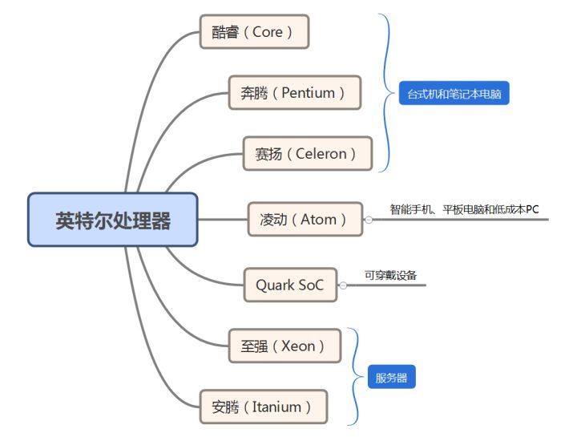
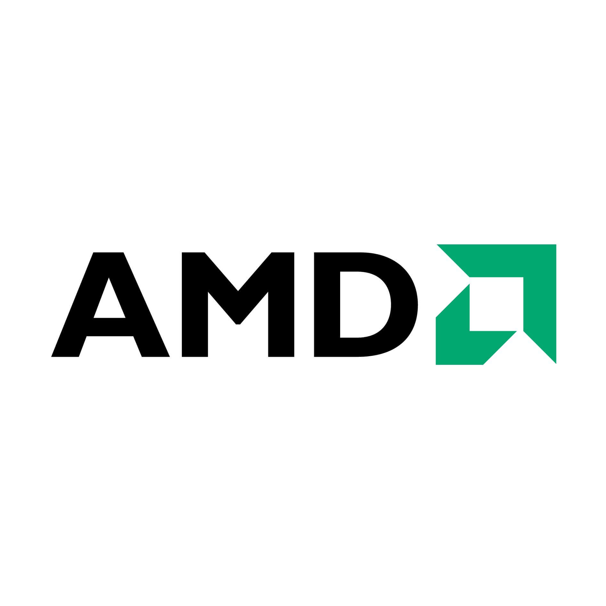
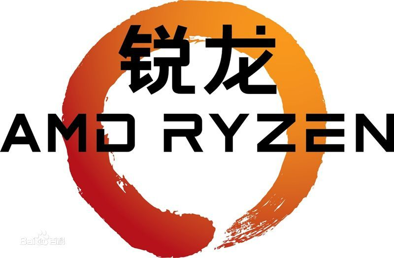
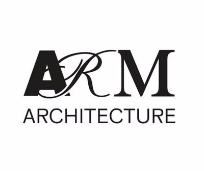

# CPU: Central Processing Unit
## Introduction
A central processing unit (CPU), also called a central processor or main processor, is the electronic circuitry within a computer that carries out the instructions of a computer program by performing the basic arithmetic, logic, controlling, and input/output (I/O) operations specified by the instructions. The computer industry has used the term "central processing unit" at least since the early 1960s. Traditionally, the term "CPU" refers to a processor, more specifically to its processing unit and control unit (CU), distinguishing these core elements of a computer from external components such as main memory and I/O circuitry.
## Key indicators
### Clock Rate (Frequency)
* **Introduction** 

The clock rate typically refers to the frequency at which the clock circuit of a processor can generate pulses, which are used to synchronize the operations (such as adding two numbers or transferring a value from one register to another) of its components, and is used as an indicator of the processor's speed. It is measured in clock cycles per second or its equivalent, the SI unit hertz (Hz). The clock rate of the first generation of computers was measured in hertz or kilohertz (kHz), the first personal computers (PCs) to arrive throughout the 1970s and 1980s had clock rates measured in megahertz (MHz), and in the 21st century the speed of modern CPUs is commonly advertised in gigahertz (GHz). This metric is most useful when comparing processors within the same family, holding constant other features that may affect performance. Video card and CPU manufacturers commonly select their highest performing units from a manufacturing batch and set their maximum clock rate higher, fetching a higher price.

* **Scope**

Due to the issue of heat dissipation, it's difficult for CPUs to have the frequency more then 5.0GHz. For example, the Intel Core CPUs have frequency between 2GHz to 5GHz, and the CPU of my laptop(Core i7-8750H) has 2.2GHz frequency.

### Core
* **Introduction** 

Multiple-cores enable a CPU to execute the instructions in parallel and thus enhances its performance. The instructions are ordinary CPU instructions (such as add, move data, and branch) but the single processor can run instructions on separate cores at the same time, increasing overall speed for programs that support multithreading or other parallel computing techniques. Manufacturers typically integrate the cores onto a single integrated circuit die (known as a chip multiprocessor or CMP) or onto multiple dies in a single chip package. 

* **Scope**

Intel's first multi-core CPU was born in 2005, when most CPUs have only one core. Nowadays, most PC multi-core CPUs have 2 to 8 cores. Some state-of-the-art CPU has more cores. For example, the Intel Core i9-7980XE CPUs have 18 cores. 

* **Hyper-threading**

Hyper-Threading is a technology used by some Intel microprocessor s that allows a single microprocessor to act like two separate processors to the operating system and the application program s that use it. It is a feature of Intel's IA-32 processor architecture.

### Others
Some other indicators can also scale the quality of a CPU.
* Cache: the capacity and speed of the cache (L1,L2,L3).
* Memory bus speed: the speed to fetch the data from memory.
* Expansion bus speed: the speed to fetch the data from some extended bus, for example, PCIe.
* Superscalar: the ability for a CPU to execute multiple instructions with in a single clock cycle.
* Supply Voltage: the working voltage for CPU.
* CPI: cycles-per-instruction
* MIPS: million-instructions-per-second;

etc.  

## Vendors
### Intel

	

Intel is the world's second largest and second highest valued semiconductor chip manufacturer based on revenue after being overtaken by Samsung Electronics, and is the inventor of the x86 series of microprocessors, the processors found in most personal computers (PCs). Intel ranked No. 46 in the 2018 Fortune 500 list of the largest United States corporations by total revenue. 

#### Architecture
x86-64.

#### Features
----------------
Main Products:

	

* **Core Series**

For high-end market

| Generation | Microarchitecture      |  Release date   |
| -------    | ---- | ----   |
| 1 | Nehalem | 2008 |
| 2 | Sandy Bridge | 2011 |
| 3 | Ivy Bridge | 2012 |
| 4 | Haswell | 2013 |
| 5 | Broadwell | 2014 |
| 6 | Skylake | 2015 |
| 7 | Kaby lake | 2016 |
| 8 | Coffee lake, Whiskey lake, Cannon lake, Amber lake | 2017 |
| 9 | Coffee lake refresh | 2018 | 
| 10 | Ice lake, Comet lake| 2019 |

* **Others**

| Series| Use   |
| -     | -     |
| Pentium | For low-end market |
| Celeron | For low end market |
| Xeon | Mainly for servers. |
| Itanium | Mainly for servers.|
| Atom | Maily for mobile devices.|
| Quark SoC | Mainly for wearable devices |

--------------------
Pros & Cons
> Based on the comparation between AMD.

**Pros:**
* Best manufacture craft. 
* Better performance with the same clock rate.
* Software: more specific optimization.

**Cons:**
* More costly.
* Silica gel for cooling.
-------------------------
### AMD

	

Advanced Micro Devices, Inc. (AMD) is an American multinational semiconductor company based in Santa Clara, California that develops computer processors and related technologies for business and consumer markets. AMD's main products include microprocessors, motherboard chipsets, embedded processors and graphics processors for servers, workstations, personal computers and embedded system applications.

AMD is the second-largest supplier and only significant rival to Intel in the market for x86-based microprocessors. Since acquiring ATI in 2006, AMD and its competitor Nvidia have maintained a duopoly in the discrete graphics processing unit (GPU) market.

#### Architecture
x86-64. AMD is the inventor of x86-64. It owns the intellectual property of x86-64 with Intel together.

#### Features
------------
Main Products:

* Ryzen

	

* Athlon
* Opteron
* Tushion
------------
Pros & Cons

> Based on the comparation between Intel

**Pros:**

* Cheaper 
* Better performance at similar price.
* More cores.

**Cons:**

* Higher power dissipation
* Do not support hyperthreading.

### ARM

	

ARM (Advanced RISC Machine) is not only a CPU vendor, but also a RISC CPU architecture. Arm Holdings develops the architecture and licenses it to other companies, who design their own products that implement one of those architectures‍—‌including systems-on-chips (SoC) and systems-on-modules (SoM) that incorporate memory, interfaces, radios, etc. It also designs cores that implement this instruction set and licenses these designs to a number of companies that incorporate those core designs into their own products.

#### Feature
Processors that have a RISC architecture typically require fewer transistors than those with a complex instruction set computing (CISC) architecture (such as the x86 processors found in most personal computers), which improves cost, power consumption, and heat dissipation. These characteristics are desirable for light, portable, battery-powered devices‍—‌including smartphones, laptops and tablet computers, and other embedded systems. For supercomputers, which consume large amounts of electricity, ARM could also be a power-efficient solution. Almost 99% of smart phones use ARM architecture.

------
Pros & Cons
> Based on the comparation between x86 

**Pros:**
* Low power dissipation (Key advantage).
* Neatly switch from 64bits to 32 bits.
* big.LITTLE architecture: enable different cores running in a same processor.

**Cons:**
* Worse performance in out-of-order execution
* Worse multi-threading support.

In a nutshell, x86 concentrate on performance whereas ARM focus on power dissipation.

## My Own Comments
### Trade-off

CPU charactors are always a trade-off, which can partially explain why different vendors are able to occupy the same market momentarily. For consumers, it's better to consider the requirements carefully, and choose the most suitable product.

* AMD or Intel? 
    
AMD and Intel are direct competator, targeting at the same CPU market with the same architecture. Today, AMD's CPUs are cheaper, while Intel's CPUs have better manufacturing craft, with better manufacturing process. For PC consumers, when considering the cost performance, it's better to choose AMD. Else, choose Intel.

* x86 or ARM?

As there are many differences between the design philosophy of CISC and RISC, the problem is very easy to answer. ARM can be used on mobile phones or wearable devices considering its low power dissipation, while x86 can be used on PCs or servers considering its high performance.

### Ways to Develop
Reviewing the history of different CPU vendors, we can see that even though they have been competing each other for many years, their own designs inspired and referenced each other. For example, x86 was firstly created by Intel (Intel 8086 CPU), but AMD invented the 64 bit x86 architecture (x86-64). Moreover, with the introduction of microcode in Intel CPUs, the border between RISC and CISC architectures are obfuscated. In order to survive the cruel market, a vendor must keep learning other designs and never stop improving their own products. There's never a best design, but an eternally continuous developing design.