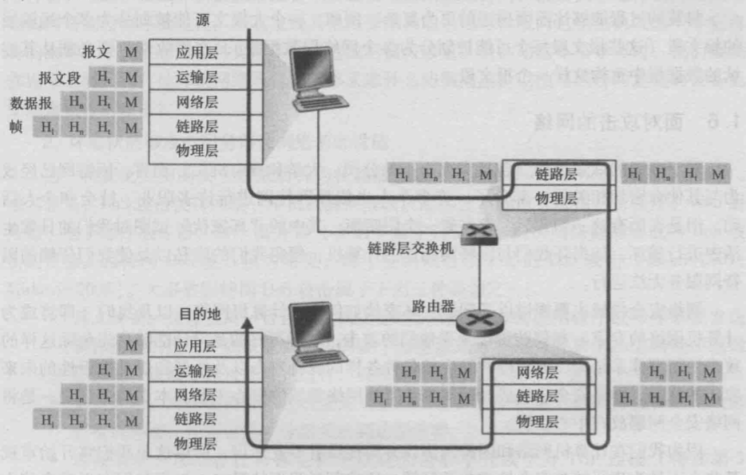
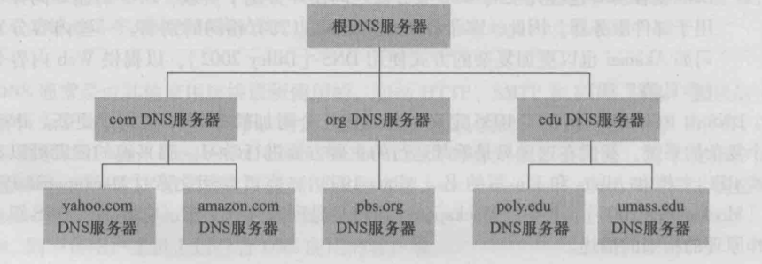
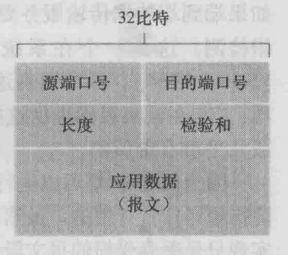
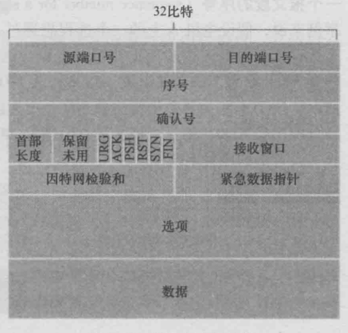
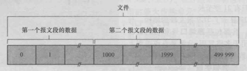
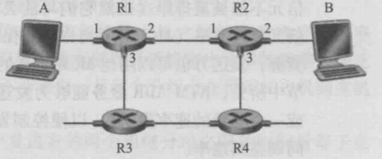
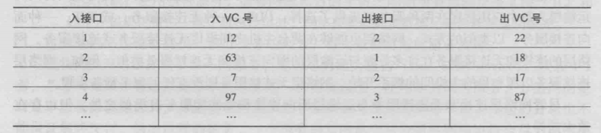
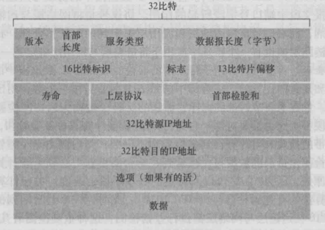
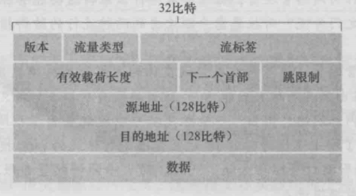
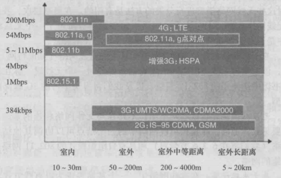

# Computer Network 计算机网络
## Introduction 导入

> 早期计算机技术并没有与网络通信技术直接联系。随着工业、
商业与军事部门的使用计算机的深入，
人们需要将分散在不同地方的数据进行集中处理。因此，
人们发明了一种叫做`收发器`的终端设备，可以将穿孔卡片上的数据利用电话线路发送到远处的计算机。

由此，形成了 `终端-通信线路-计算机`，这也是计算机网络的雏形。

此后计算机网络不断发展，至今一共经历了四个阶段:
* 面向终端的计算机通信网络 
    &nbsp;&nbsp;

    此阶段通过网络连接的时终端，比如电话机等，计算机作为中心，
    所有网络均连接到计算机上，计算机获取网络上的数据进行集中处理。
* 计算机互联网络
    &nbsp;&nbsp;
    此阶段建立在`英国国家物理实验室 NPL 的Davies提出的分组(Packet)概念基础上`。
    核心时`分组交换技术`，相当于使用通信网络将`面向终端的计算机`连起来，是的计算机不仅可以获取终端的数据，
    还可以访问网络上的其他计算机提供的资源。
* 具有统一的网络体系结构、遵循国际标准化协议的标准计算机网络
    &nbsp;&nbsp;
    基于`计算机互联网络`，计算机网络体系结构不断发展，为了使得不同体系结构的计算机可以相互连通，
    国际标准化组织ISO提出了一个能使各种计算机在世界范围内互联成网的标准框架 ————
    开放系统互连参考模型(Open System Interconnection Reference Model, OSI/RM)
* 网络互联与高速网络
    &nbsp;&nbsp;
    此阶段的计算机网络已经告诉发展，形成了遍布全球的通信网络`Internet`。此阶段
    的计算机实现了IP化，应用TCP/IP协议组建整个通信网。

## Basis Of Computer Network (网络基础知识)
* IPv4 
    由四个8位整数组成，范围 0 ~ 255。部分IP保留位内部局域网及广播等用途
    * 10.*， 192.168.*， 172.16.* ~ 172.31.* 保留位内部局域网
    * 127.* 软件回环测试
* 子网掩码 
    IP由网络号和主机号构成，比如192.168.1.2/24, 则192.168.1就是网络号(Net-ID),
    2则是主机号。 
    其中 /24 既是掩码，用来判断网络号和主机号，从而判断两个IP是否是同一个网段
    下 
    /24的意思是: 24个1，从掩码的角度看，也即是在该网段下，所有IP前面的24位bit
    都是一样的。并且，掩码和IP获的网络号的方法是 Net-ID & 子网掩码(255.255.255.0)
* 常见模型
    * OSI/RM 七层网络模型 (Open Sysem Inderconnect) 
        OSI 模型系统全面，理论研究完整，分层结构较为清晰，但是因为分了
        7层，实现复杂度较高，在实际应用中比较少
    * TCP/IP 四层网络模型(也可以说是三层) 
        TCP/IP 模型实在网络建立起来之后，根据协议建立的模型，应用上完全适应
        TCP/IP协议，但是相比OSI模型理论并不完整。因为只有四层，实现和应用都比
        OSI模型方便，应用也更加广泛

* 种类
    * 无线网 (WIFI) 
        * 没有可见介质，传输依靠红外线、微波、无线电等介质。
        * 无线信号以电磁波的形式存在
    * 有线网 (Wired Network) 
        * 传输依靠双绞线、同轴电缆、光缆等
* 传输参数
    * 数据传输速率 
    即常见的网速，单位一般为 bps, bit per second. 单位时间内，传送的二进制的
    有效位数
    * 波特率 
        * 也称位调制速率、波形速率或者码元速率。描述单位时间内传送的波形数，1 Baud 代表
        一秒钟内，传送了1 个波形
        * 波形对应数字信号，即bit，若是`二相调制`，即一个波形对应2个bit, 低电平、
        高电平。若是`四相调制`,即一个波形对应4个bit， 0，1/4，1/2，1四个bit。
        * 波特率(B)和数据传输速率(S)有对应关系，S = Blog2n
* 硬件
    * 调制解调器 
        在电信号和模拟输入信号进行转换
    * 链路交换机 
        基于链路层字段中的值做转发决定
    * 路由器 
        基于网络层字段中的值做转发决定
    
## Top-Down Approach 自顶向下分析因特网
### Introduction 
在Internet传输

### Application 应用层

#### Protocols 主要协议
1. HTTP 协议
    * HTTP协议使用TCP作为其支撑运输协议。HTTP客户首先发起一个与服务器的连接，建立连接后，通过套接字收发报文。
    * HTTP协议是**非持续链接**的协议，因此HTTP协议在获取DOC文档对象后对文档进行解析，得到其他文档的引用，例如图片的引用，CSS文件的引用，再重复获取DOC文档的流程，进行TCP连接获取这些引用文档的数据。

2. SMTP 协议
    * SMTP协议是早期提出来的，英特网电子邮件应用的核心。
    * SMTP协议仅支持ASCII字节码，因此如果需要使用SMTO协议传输二进制，需要进行转码。( XMPP也是这样的，不过也有相应的二进制提议解决方案
3. FTP 协议 
    * 文件传输协议。
    * FTP使用两个并行的TCP连接进行传输文件，一个是 `控制连接`, 一个是 `数据连接`。
    * `控制连接`在FTP客户端首先在服务器21端口发起控制的TCP连接时建立。FTP客户端通过该控制连接发送用户的标识和口令，更改远程服务器目录(创建文件、删除文件...)命令也是通过控制连接进行发送。当服务器在控制连接收到文件传输的命令后，就发起一个到客户端的TCP数据连接，(通过控制连接辨别客户端)

#### TCP / UDP
1. TCP 传输
    > TCP传输服务包括面向连接服务和可靠数据传输服务。

    * 面向连接的服务
        * 在应用层数据报文考试流动之前，TCP让客户和服务器交换运输层控制信息，即所谓的握手。
        * 握手完成之后, 一个TCP连接就在两个进程的套接字之间建立了，并且这个连接是全双工的，即连接双方可以同时进行报文收发。
    * 可靠的数据传送服务
        * 依靠TCP可以就行无差错、按照适当顺序的数据交换。
    * 拥塞控制机制

2. UDP 传输
    > UDP传输服务仅提供最小服务，不提供不必要服务的轻量级运输服务。
    
    UDP是无连接的，它提供的数据传输服务是不可靠的，因为它在传输前不会确定目的地是否连接成功，并且也不保证传输顺序。 
    也因此，UDP是一种轻量级传输服务，应用在容错性大的app上效率较高。

Applications choices    
|应用|应用层协议|支撑的运输协议|
|---|---|---|
|电子邮件|SMTP|TCP|
|Web|HTTP|TCP|
|文件传输|FTP|TCP|
|即时通讯|XMPP，QQ |UDP、TCP|

#### DNS (Domain Name System)
由于计算机的表示和人记忆的差别，在计算机中采用的定长数字串IP地址，对于人来来说并不是很友好。于是就产生了主机名，比如 www.baidu.com, www.google.com，为了能够使计算机和人类都能够很方便的表示记忆主机的名称，就产生了一个对应表，202.120.40.8是IP地址，计算机知道，人类只需要记忆 www.xxx.xxx 就行了

> DNS是: 1. 一个由分层的DNS服务器实现的分布式数据库。2. 一个使得主机能够查询分布式数据库的应用层协议。

> DNS服务器通常是运行在 BIND(Berkeley Internet Name Domain) 软件 的 UNIX机器。DNS协议运行在UDP之上，使用53端口。

**DNS 作用**:
1. 主机别名
    有些主机的名称比较复杂，它可以获得别名(canonical hostname)，当应用程序需要知道该主机的IP时，就可以通过DNS获取规范的主机名和IP地址。
2. 负载均衡
    有些主机名对应很多个IP，这些冗余的主机用来均衡负载。那么当有请求到这个主机名时，DNS就会按照一定的规则返回IP地址，这样做就可以分摊服务器的压力。

**DNS采用了分布式的设计方案**:

**DNS 分类**
* 根DNS服务器
* 顶级域服务器
* 权威DNS服务器

以上的分类对应于上面的DNS分布式架构图。 
DNS查询往往需要先发送给`根DNS服务器`，然后`根DNS服务器`通过查看顶级域名，返回`顶级域服务器`的IP列表。获取到`顶级域服务器`IP列表后，选择其中之一，发送请求，`顶级域服务器`返回对应的`权威DNS服务器`。最后发送给`权威DNS服务器`，获取目标主机的IP地址。

### Transport 运输层

#### UDP协议
> UDP协议提供除了`多路复用/分解`功能外，只提供了极少量的差错检查，当应用程序使用UDP协议进行应用开发，应用几乎是直接与IP打交道。

##### UDP 应用及特性
1. DNS 是UDP的典型应用，DNS利用了 UDP 无连接的特性，在每一次发送请求时不需要握手，直接发送请求，然后等待响应。如果没有受到相应，则重发请求或者处理失败。
2. 即时消息 也经常应用UDP协议，比如国内的QQ就是应用的UDP协议发送数据，TCP进行辅助连接。为什么采用UDP，是因为，在这种通信中，应用程序往往希望数据发送给底层之后，就尽快的发送给目的地，UDP没有三次握手的overhead；跟重要的时，TCP为了提高网络性能，有一个拥塞机制，它为了保证数据的可靠传输，可能会一直等待网络通畅，不能保证即时性；此外，在即时消息中，并不要求数据一定按照顺序，或者说一定要可靠传输，即时丢包了，对方一般也能够理解，
3. 相比TCP, UDP的首部字节长度更小，TCP是20，而UDP仅为8

##### UDP 报文结构

1. 长度是UDP报文的数据字段的长度，即图片中应用数据(报文)的长度
2. 检验和是UDP用来检验数据是否出错的 
##### UDP差错校验
> 检验和用于确定当UDP报文段从源到目的地移动时，其中的比特是否发生了改变(例如，由于链路中的噪声干扰或者存储在路由器中时引入问题)。

校验和的计算方法如下： 
无论是在发送端还是接收端，都是将UDP首部四个字段进行二进制加法，最后取反。假发过程中如果出现溢出，则将溢出的高位(只可能有一位溢出)和去掉最高位的结果加法运算，用表达式表示就是  
1xxx0 -> xxx0 + 1 = xxx1;

1. 在发送端
首先将检验和字段置零，然后将首部四个字段按照上述方法进行计算得到检验和

2. 在接收端
将首部四个字段进行 加法运算，溢出按照上述方法处理。如果最后得到的和是 11111, 全1则数据没有丢失或者变形，否则数据出现了丢失或者变形。

#### TCP协议

* TCP是面向连接的，即进程间在发送数据之前必须先相互“握手”
* TCP运行在终端中。
* TCP是全双工的服务。

**TCP 发送接受数据流程** 
!(TCP收发数据图)[./imgs/networl-tcp-flow.png]
> TCP建立连接后，发送端的TCP将数据引导入该链接的**发送缓存**里，发送缓存是在三次握手初期设置的缓存之一。然后，TCP会在最方便的时候从发送缓存里去除一块数据进行发送。TCP从缓存中去除并放入报文中的数据量由`最大报文段长度(Maximum Segment Size, MSS)`限制。MSS通常根据最初确定的由本地发送主机发送的最大链路层帧长度(最大传输单元 Maximum Transmission Unit, MTU)设置来保证一个TCP报文段加上TCP/IP头适应一个链路层帧

**TCP 报文结构**

1. 序号和确认号是用来实现可靠数据传输的
2. 接收窗口字段用于流量控制，这个字段表示接收方愿意接受的字节数量
3. ACK是确认字段，用来标志几个报文段已经被成功接收；RST、SYN、FIN适用于TCP连接建立和拆除的

##### TCP可靠传输机理
1. 序号和确认号

    **序号**
    > TCP把数据看成一个无结构的、有序的字节流。序号建立在传送的字节流上，而不是建立在传送的报文段的序列之上。一个报文段的序号是该报文段首字节的字节流编号。

    因此序号是对数据字节流的编号。
    比如，传输一个500000字节的文件，MSS(Maximum Segment Size 最大段大小，指传输时TCP数据最大大小)为1000，那么TCP将会构建500个报文段，假设第一个报文段序号为10，那么第二个就是1010，第三个就是2010，以此类推。

    

    **确认号** 
    确认号是在主机A接受到数据后，发送给B的报文中填写希望得到的报文段的序号。

    > 举例来说，主机A已经收到包含字节 0 ~ 535的报文段，在收到第二个报文段(字节536 ~ 899) 之前收到第三个报文段（字节 900 ~ 1000）。第三个报文段是**失序到达**，那么主机A的TCP就会在下一个发送给B的报文段中添加确认号字段 536，致于已经收到的是**失序到达**的报文段如何处理，RFC并没有明确，由编程实现的代码决定

2. 超时间隔加倍
3. 快速重传
4. 流量控制

##### TCP连接管理
**TCP连接流程**
TCP连接前通常进行三次握手，三次握手是
1. 客户端A向服务器B发送一个TCP报文段，其中`SYN标志位`被标志为1，此外，客户端还会随机选择一个初始序号。
2. 服务器B在收到报文段之后从TCP中提取SYN标志位，如果是1(client_syn)，则为其分配缓存和变量。之后，服务器B将确认号置为client_sync + 1(报文段没有数据)，发送SYNACK报文段。
3. 客户端收到SYNACK报文段之后，就会分配TCP缓存和变量。此时，客户端就会向序号中填写，server_syn + 1，发送给服务器B，此时报文段的SYN为0，数据段可以携带数据。

> SYN flood attack，即在TCP连接阶段，发送大量的连接请求，却不完成三次握手中的第三次握手，造成服务器B分配大量的缓存，空间不足。

##### TCP拥塞控制原理

### Network 网络层
> 网络层接受来自运输层的报文段，并包装呈数据报(即一个网络层的分组)，然后将该数据发向相邻路由器R1发送。在接收方，网络层接受来自相邻路由器R2的数据包，提取出报文段交付给运输层。

网络层主要是将分组从一台发送主机移动到另一台接收主机。 
为此网络层提供了两个重要功能：
1. 转发(forwarding)

    将分组从一个输入链路接口转移倒是当的输出链路接口的路由器本地动作。
2. 路由选择(routing)

    决定分组从源到目的地所采取的端到端路径。

#### 网络层的服务
> 类似运输层为应用程序提供无连接服务和面向连接服务，网络层也能够在两台主机之间提供无连接服务或连接服务。其中仅在网络层提供连接服务的计算机网络成为虚电路网络；仅在网络层提供无连接服务的计算机网络称为数据报网络。

##### 虚电路网络
虚电路由以下几部分组成:
1. 源和目的主机之间的路径(即一系列链路和路由器)
2. VC号，沿着该路径的每段链路的一个号码
3. 沿着该路径的每台路由器中的转发表表项。

在虚电路网络中传输时，虚电路的分组将会在首部携带一个VC号，当分组通过路由器时，路由器必须用一个新的VC号替代每个传输分组的VC号。

例如上图，主机A到主机B的虚电路连接 A-R1-R2-B，网络层会为这条链接确定一链路的VC号，然后主机A在连接到第一个路由器会为分组首部填写一个VC号，没经过一个链路的路由器，就会换成对应的VC号。

路由器根据上表和入接口的VC号来进行转换。

**虚电路主要阶段**
1. 虚电路建立
    > 在建立阶段，发送运输层与网络层联系，指定接收方地址，等待网络建立虚电路。 网络层决定发送方与接收方之间的路径，即该虚电路的所有分组要通过的一系列连路与路由器。 网络层也为沿着该路径的每条链路决定一个VC号。最后，网络层在沿着路径的每台路由器的转发表中增加一个表项。
2. 数据传送
    虚电路建立后，分组就会沿该虚电路进行传送
3. 虚电路拆除
    网络层将通知另一端结束连接，然后更新路径上每台分组路由器中的转发表来表示该虚电路已经不存在了。

##### 数据网络
> 在数据报网络中，每当一个端系统要发送分组，它就为该分组加上目的端系统的地址，然后将分组推进网络中。无需建立任何虚电路，路由器不维护任何续虚电路的状态信息。 
分组传输通过一些列路由器传递。这些路由器中的每台都是用分组的目的地址来转发该分组。每台路由器都有一个将目的地址映射到链路接口的转发表。当分组到达路由器时，路由器使用该分组的目的地址再转发表中查找适当的输出链路接口

#### 路由器工作原理

1. 输入端口
    * 输入端口需要执行将一条输入的物理链路与路由器相连接的物理层功能。
    * 执行与链路远端的数据链路层交互的数据链路层功能。
    * 在输入端口还需要执行查找功能。正是在这里，通过查询转发表决定路由器的输出端口。
2. 交换结构
    * 交换结构将路由器的输入端口与输出端口相连接。它的作用相当于路由器中的网络。
    * 交换结构有多种方式实现
        * 经内存交换
        * 经总线交换
        * 经互联网交换
3. 输出端口
    * 输出端口存储从交换结构接收的分组，并通过执行必要的链路层和物理层功能在输入链路上传输分组。
4. 路由选择处理器
    * 路由选择处理器执行路由选择协议，维护路由选择表以及连接的链路状态信息，并为路由器计算转发表。

#### 网际协议 IPv4 IPv6
##### 数据报格式

* 版本号
    规定了IP协议版本。
* 首部长度
    IPv4包含可变数量的选项，所以需要用4比特来确定IP数据包中数据部分从哪里开始。
* 服务类型
    用来区别不同类型的IP数据报，比如实时数据报(IP电话应用)和非实时流量(FTP)
* 数据报长度
    IP数据报的总长度(首部+数据)
* 标识、标志、片偏移
    与IP分片有关
* 寿命
    每当数据报由一台路由器处理时，该字段的值减1。如果TTL字段减到0，则丢弃该数据包。这样可以确保IP数据报不会永远在网络中循环
* 协议
    该字段制定了IP数据包的数据部分应交给那个指定的运输层协议，6交给TCP，17交给UDP。
* 首部检验和
    帮助路由器检测收到的IP数据报中的bit错误。

**IP数据分片**

> 一个链路层帧能承载的最大数据量叫做最大传送单元(MTU, Maximum Transfer Unit)

IP数据报的大小受限于MTU，因此IP数据报要小于MTU，但是每条链路运行具有不同MTU的链路层协议，为了能使IP数据报通过链路，路由器会将IP数据报中的数据进行分片。

**DHCP动态主机配置协议(即插即用协议)**

> DHCP协议对接入的主机进行四个步骤

1. DHCP服务器发现
    新接入的主机第一件事是发送一个`DHCP发现报文`，这个报文由主机通过UDP分组向端口67发送。源地址是0.0.0.0，目的地址是255.255.255.255广播地址
2. DHCP服务器提供
    DHCP服务器收到发现报文后，就会回应一个DHCP提供报文，仍然使用广播地址255.255.255.255。报文包含IP地址、网络掩码以及IP地址租用期。
3. DHCP请求
    收到提供报文后，从多个服务器中选择一个，并向选中的服务提供一个DHCP请求报文。
4. DHCP ACK 
    服务器回应DHCP ACK报文。

**NAT(Network address transfer， 网络地址转换)**

用于LAN和WAN之间的访问。由于IPv4的使用越来越大于IPv4容量以及家庭网络的普及，NAT应运而生。当LAN中的主机A访问WAN网络，主机A将数据传送到路由器，路由器从ISP的DHCP服务器得到其地址，并将主机A请求的IP更换为从ISP获取的IP地址，将主机A的请求源端口号改写呈当前NAT中空闲的端口号，将之加入转换表。

**IPv6**

* 版本
* 流量类型
    和IPv4中的TOS(Type Of Stream), 实时数据报等
* 流标签
    标识一条数据报的流，用来区分网络层不同的报文
* 有效载荷长度
    数据长度
* 下一个首部
    数据报内容需要交付给哪个协议(TCP/UDP/...)
* 跳限制
    每经过路由器减1
* 源地址和目的地址
* 数据
* 分片/重新组装
    IPv6不允许分片与重新组装。如果经过某个路由器，发现数据报大小大于MTU，则路由器将丢弃数据，并返回一个“分组太大”的错误码。
* 首部检验和
* 选项

#### 路由选择算法

### Data Link 链路层、物理层

> 链路是两个`结点`之间，沿着通信路径连接相邻结点的通信信道。`结点`是运行链路层协议的任何设备，包括主机、路由器、交换机、WiFi接入点等

**链路层提供的服务**

1. 成帧
    > 在每个网络层数据报经链路传送之前，几乎所有的链路层协议都要将其用链路层帧封装起来。一个帧由一个数据字段和若干首部字段组成。

2. 链路接入
3. 可靠交付
4. 差错检测和纠正

> 链路层的主体部分实在网络适配器中实现的，网络适配器有时也被称为网络接口卡(Network Interface Card, NIC)

#### 链路层差错校验和纠正技术
##### 奇偶校验
    比较传送前后的报文bit奇偶个数。由此衍生的还有二维奇偶校验。
##### 检验和(checksum)
    checksum和之前的TCP/UDP检验和一样
##### 循环冗余(Cyclic Redundancy Check)
    循环冗余检测编码(Cyclic Redundancy Check)CRC编码是计算机网络中应用比较广泛的差错检测技术。(这个没仔细看)

#### 交换局域网
##### 链路层地址
主机和路由器在链路层还有地址，或者说主机和路由器的网络适配器有链路层地址。这个链路层地址又叫 LAN地址、物理地址、MAC地址。MAC地址长6字节。**没有两块设备拥有相同的MAC地址**

##### 链路层地址解析协议
在局域网中，当两个相同子网中的计算机进行通信时，为了发送数据，源主机不仅要提供IP数据报，而且要提供目的主机的MAC地址。为了能够确定拥有IP地址的主机对应的MAC地址，源主机一般使用ARP协议进行地址解析。

###### ARP工作原理
每个主机或路由器在其内存中保存一个ARP表，这张表包含IP地址到MAC地址的映射关系。

那么现在考虑主机A和主机B处在同一个子网中，主机A将要向主机B发送一段IP数据报，如果主机A的ARP表项中有主机B的MAC地址，那就直接拿到MAC地址发送过去；
但是如果主机A的ARP表项没有该墓地主机的表项，主机A就会用ARP协议解析这个地址。

发送方主机A构造一个称为ARP分组的特殊分组，包括发送和接收IP地址及MAC地址。

#### 链路层交换机
1. 交换机转发和过滤

    **过滤**是决定一个帧应该转发到某个接口还是应当将其丢弃的交换机功能。**转发**是决定一个帧应该被导向哪个接口，并把该帧移动到那些接口的交换机功能。交换机的过滤和转发依赖于交换机表。

交换机表的表项包含：1. MAC地址 2. 通往该MAC地址的交换机接口 3. 过期时间 

2. 交换机学习功能

    交换机并不是一开始就有表的，交换机对每个接口接收到的入帧，存储在表中 1. 帧源地址的MAC地址 2. 帧到达接口 3. 当前时间

## Different Types Of Network 网络的不同类型

### LAN 局域网
#### WHAT IS LAN 什么是局域网
> 局域网（Local Area Network, LAN），又称内网。指覆盖局部区域（如办公室或楼层）的计算机网络。按照网络覆盖的区域（距离）不同，其他的网络类型还包括个人网、城域网、广域网等

局域网经历了 链式局域网、令牌环与AppleTalk技术后，以太网和Wi-Fi（无线网络连接）是现今主要技术实现。

##### 链式局域网
(没找到相关资料)
##### 令牌环
> 令牌环网络是1980年代中期由IBM开发，很长一段时间是IBM的网络标准、被IBM生产所有的计算机支持。令牌环可以用桥接器或路由器连接其他网络。令牌环网络在实际应用中确实是“环”形网络，只不过由于使用所谓多站接入单元设备而可以实现星形布线

**优点**
1. 利用令牌（代表发信号的许可）来避免网络中的冲突，它与使用冲突检测算法CSMA/CD的以太网相比能提高网络的数据传送率。
2. 它还可以设定传送的优先度。一个4M的令牌环网络和一个10M的以太网数据传送率相当，一个16M的令牌环网络的数据传送率接近一个100M的以太网。
**缺点**
1. 令牌环网络不可复用，网络利用率低下。当网络中一个结点拿到令牌而使用网络后，不管此结点使用多少带宽，其他结点都必须等待其使用完网络并放弃令牌后才有机会申请令牌并使用网络。
2. 网络需要额外开销维护令牌

以上内容摘自[维基百科](https://zh.wikipedia.org/wiki/%E4%BB%A4%E7%89%8C%E7%8E%AF)
##### AppleTalk
> 由苹果公司开发的一套专有软件通讯协议堆叠。在麦金塔电脑上，不需要特别设定，或是通过某些服务器，就可以直接透过AppleTalk连结到局域网络中。

### WAN 广域网

#### WHAT IS WAN
> 又称广域网、外网、公网。是连接不同地区局域网或城域网计算机通信的远程网。通常跨接很大的物理范围，所覆盖的范围从几十公里到几千公里，它能连接多个地区、城市和国家，或横跨几个洲并能提供远距离通信，形成国际性的远程网络。广域网并不等同于互联网。(引自[维基百科](https://zh.wikipedia.org/wiki/%E5%B9%BF%E5%9F%9F%E7%BD%91))

* 互联网专指最大的公共广域网，也就是常说的互联网。

#### 广域网和局域网之间的优缺点
* 覆盖范围
    * 局域网一般在办公楼或学校等集中的地区，一般只有几千米。
    * 广域网可以连接一个国家、一个洲、全世界。
* 传输介质
    * 局域网可以通过无线、双绞线、光纤传输
    * 广域网则要通过光纤传输。(有本书上说是电话线，这该很老了吧)
* 网络性能
    *局域网速度比广域网更加快一点，广域网需要做较多的差错检验，加之距离远，中转多，性能一般更差。

### Wiredless Network 无线网
#### 概念
1. 无线主机
    连接到无线网络的终端叫无线主机，比如手机、笔记本电脑、智能硬件等等。
2. 无线链路
    在有线网中，双绞线、光纤作为链路用来传输物理数据。在无线网中也有链路，这种无线网中的
    链路叫做无线链路，一般为电磁波。
    
3. 基站
    基站是无线网络基础设施的一个关键部分。基站负责从关联的无线主机接收数据和向其发送数据。
    当无线主机在基站的无线通信覆盖范围内时或者无线主机使用该基站中继它和更大网络之间的数据，
    该无线主机称为与基站关联。
    无线LAN接入点和蜂窝数据网络的蜂窝塔都是基站的例子。

#### 无线网络特性
##### 有线链路和无线链路的区别
1. 无线链路的信号强度会随距离递减，尤其是当穿过物体时。
2. 无线链路可能因为同频段的信号而产生干扰，收到周围的电磁噪声导致网络异常。
3. 多径传播，电磁波在传播时受物体和地面反射，形成不同长度的路径。

##### CDMA (Code Division Multiple Access)码分多址
由于无线频段的缺稀，当手机热点和路由器WiFi同时工作时，为了减少噪声，CDMA协议将要发送的
比特诚意一个信号的比特来编码，信号的变化速率比初始数据比特序列的变化速率快得多。
(比较复杂，未来再看)

### WiFi (IEEE 802.11无线LAN)
WiFi是一项无线局域网技术，是基于IEEE 802.11标准是一个协议族，包括802.11b, 802.11a, 802.11g等。

> Wi-Fi这个术语被人们普遍误认为是指无线保真(Wireless Fidelity)

以上引自 [维基百科](https://zh.wikipedia.org/wiki/Wi-Fi), 有趣的是，我在看的第一本书就是写的无线保真。

代号|频段|速率
---|----|----
802.11b|2.4GHz|11Mbit/s
802.11a|5GHz|54Mbit/s
802.11g|2.4GHz|54Mbits/s
802.11n|24/5GHz|216.7Mbit/s 或 450Mbit/s

### 2G、3G、4G 蜂窝数据移动网络
#### 为什么叫蜂窝数据网络
因为最初的时候，设计基站理想时形成一个一个六边形，形成类似蜂窝一样的网络，也就是下面这样

蜂窝想要让步每个六边形都能拥有一个收发基站，这个收发基站负责小区内的移动站点发送或接收信号。

#### 2G (Second Generation)
> 2G蜂窝系统的GSM标准对空中接口使用了组合FDM/TDM(无线电)。一个GSM网络还有一个基站控制器(Base Station Controller, BSC) 通常
服务于几十个收发基站。基站控制器及其控制的基站共同组成了GSM基站系统。

#### 3G
> 3G在2G的核心GSM蜂窝语音网基础上，增加与现有蜂窝语音王并行的附加蜂窝数据功能。
在

在3G核心网中，有两类结点：**服务通用分组无线服务支持结点**(Serving Generalized packet radio service
Support Node, SGSN)和**网关GPRS支持结点**(Gateway GPRS Support Node, GGSN)

3G的通话和上网采用不同服务，

#### 4G
4G有两种主要技术： LTE(4G Long-Term Evolution)和WiMAX(全球微波接入操作)

##### LTE
> 与3G相比，4G LTE主要有两种创新，**演化的分组核**和**LTE无线电接入网**

##### WiMAX
暂时没找到响应的资料
#### 5G
**5G优点**
1. 更快速度
    5G比现有有线网更加快，比4G快100倍
2. 更低延迟
    5G比4G拥有更低的延迟，4G大概在数十毫秒量级，5G可以达到1毫秒以内。
**5G** 原理
1. 波频
    5G采用更高的频率，因此传播速度也会更加快。5G网络一般在30-300GHz的毫米波波段内。
2. 频宽
    5G使用更宽的频道与无线设备进行通信，频宽最高可以达到800MHz，而4G是20MHz。这样5G每秒就可以传输更多的比特

**5G缺点**
1. 范围更小
    由于更高的频率，5G辐射范围比以前更小，覆盖的面积也比较小，一般就一个街道，而4G可以覆盖数公里。

### Different Vendors of Network 网络的不同厂商
#### 中国移动、中国电信、中国联通
网络上很多都说没什么区别，只是频段不一样，基站不一样。

首先可以明确的是频段肯定不一样，频段是要花钱买的，中国这三家公司买下来再提供给百姓来获益。

其次基站数量肯定也是不一样的，移动的基站数量覆盖率确实要比另外两家大一点。

### My Onw Comments 

#### Trade off
1. 数据蜂窝网络实际上就是一种trade off，频段上升的越多，传输速率越快，但是同时辐射范围也更加小，需要建造的基站越多，维护越复杂。5G虽然速度更快，潜力更大，尤其是超低延迟，但是在商用上，4G还是占很大优势，5G现在只是一种新鲜的吸引力，基站不可能短期内升级成功，覆盖范围也将更加狭窄。 
当然，科技发展，人类进步，未来，5G的应用场景一旦打开，计算机技术的个性、基础科学理论的突破必将要求5G甚至6G。

2. OSI七层模型其实就是一种trade off。计算机网络过于复杂庞大，为了简化它的复杂性，于是进行分层。最终OSI分了7层，但是同时实现的复杂性也上升了，性能肯定略有下降，最终应用广泛的还是Internet协议。

3. bit的模拟信号也是一种trade off。为什么一个波形表示两个bit？ 四个bit也可以，这样传输速率就能翻倍，但是计算机实现起来会比较复杂，worse is better，与其复杂的实现不了，不如实现个简单的版本呢

#### Way To Develop
1. 传输介质上能不能在进行升级。比如5G和4G主要是频段上升、频宽加大，那么如果能够设计出支持更高频率，更宽频宽，那么速率也会提升。(不过这个应该比较难了吧? 5G都和卫星波一个量级的波长了)
2. 把现有网络模型推到重新建立，一般来说都会比之前的更加简单，更加快捷，方便。(不过这真的是说的容易)
3. 网络技术提高，以前设想的很多模型都有机会发展，比如一个中心计算机，其他终端连入这个计算机就行了，到了未来，世界上就一个巨大的计算机，人们通过终端连入计算机，传输东西0延迟(一个计算机上)。

### References 参考

[1] James F.Kurose, Keith W.Ross. 计算机网络 自顶向下方法. 北京, 机械工业出版社. 2014 1- 391 