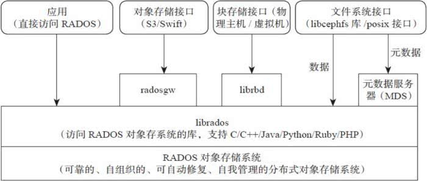

# Storage

## Definition

Understandably, many computer users consider memory and storage to be the same thing. 

Whereas memory refers to the location of short-term data, storage is the component of your computer that allows you to store and access data on a long-term basis. 

An important distinction between memory and storage is that the former clears when the computer is turned off. On the other hand, storage remains intact no matter how many times you shut off your computer. 

Usually, storage comes in the form of a solid-state drive or a hard drive. Storage allows you to access and store your applications, operating system and files for an indefinite period of time.

## Indicators

Capacity, speed, archiving life and power consumption are common performance indicators of storage devices.

There are tools to mesure these indicators, the common method is to record the write/read/move speed.

## Types of Storage

### Magnetic storage devices

Today, magnetic storage is one of the most common types of storage used with computers. Any storage medium that utilizes magnetic patterns to represent information is considered magnetic media.

1. **Floppy Disk Drive (FDD)**

  - Definition

    A floppy disk drive (FDD), or floppy drive, is a hardware device that reads data storage information. 

    FDDs are used for reading and writing on removable floppy discs. 

    FDDs had four basic components:

    1. Magnetic read/write heads (one or two)
    2. A spindle clamping device that held the disk in place as it was spinning 300 to 360 rotations per minute
    3. A frame with levers that opened and closed the device
    4. A circuit board that contained all of the electronics.

   

- Pros & Cons

  **Pros**

  1. Floppies are cheap and can be used many times.
  2. It is small and lightweight.
  3. It allows random access to data.
  4. It is useful in transferring files between computers.

  **Cons**

  1. Floppies don't have much storage capacity.
  2. It is easily destroyed by dust and dirt.
  3. Floppies can get affected by heat.
  4. It is difficult to handle.
  5. It is more prone to data loss.

- Vendors

  | Vendors | 
  | ------- | 
  | Sabrent | 
  | Samsung |
  | NEC     |
  | Mitsumi |
  | Bytecc  | 

2. **Hard Disk Drive (HDD)**

- Definition

  A hard disk drive (sometimes abbreviated as hard drive, HD, or HDD) is a non-volatile memory hardware device that permanently stores and retrieves data on a computer.

  A hard drive is a secondary storage device that consists of one or more platters to which data is written using a magnetic head, all inside of an air-sealed casing.
  
  All computers have a hard drive installed in them, which is used to store files for the operating system, software programs, and a user's personal files. A computer cannot function without a hard drive installed, as it requires one to function properly.

  Although most hard drives are internal, there are also stand-alone devices called external hard drives, which can backup data on computers and expand the available disk space. External drives are often stored in an enclosure that helps protect the drive and allows it to interface with the computer, usually over USB or eSATA.

  

  As can be seen in the picture above, the desktop hard drive consists of the following components: the head actuator, read/write actuator arm, read/write head, spindle, and platter. On the back of a hard drive is a circuit board called the disk controller or interface board and is what allows the hard drive to communicate with the computer.

- Pros & Cons

  **Pros**

  1. It is cheaper than SSD.
  2. It has larger base storage capacity.
  3. HDD is more accessible than SSD.
  4. It has higher read-write cycles.

  **Cons**

  1. It's read-write speed is slower than SSD.
  2. HDD consumes more power than a solid-state drive.
  3. HDD produces distracting mechanical sound.
  4. The form factor of HDD is bulkier than an SSD.
  5. Tts susceptibility to data loss and integrity failure due to physical vulnerability.

- Vendors

  | Vendors |   Note   |     
  | ------- | ---- | 
  | WESTERN DIGITAL|      |     
  | Seagate |      |     
  | Toshiba |    |     
  | Hitachi |    Acquired by Seagate in 2011    |    
  | Samsung |  Acquired by Seagate in 2011    |  
  | Maxtor |   Acquired by Seagate in 2007   |  
  | Fujitsu |   Acquired by Toshiba in 2009     |  
  | IBM |   Quited  | 

- My Comments

  Compared with SSD, HDD, it has some shortcomings, such as inconvenience, mechanical moving parts, slow speed and so on, but the two advantages of large capacity and no disc drop make HDD still very important computer hardware. 
  
  For my computer, I have a small SSD to install systems and programs, and two large HDDs to save files and large games. I think this can provide a better use experience at a lower cost.

3. **Tape cassette**

- Definition

  A tape is a magnetically thin coated piece of plastic wrapped around wheels capable of storing data.

  

- Pros & Cons

  **Pros**

  1. **The unit capacity cost is low,** the disk is about 2-3 yuan per GB, the tape is about 0.5 yuan per GB; 
  2. **Read-write separation, convenient transportation**, perfect backup option; 
  3. **The medium is more stable than the disk, the storage period is longer**, the guarantee period of the disk is up to 3-5 years, and the tape can be up to 50 years. 
  4. **Low energy consumption, low room construction requirements:** high disk power consumption, high operating temperature, and low tape machine power consumption, no need for temperature control system, for the construction of computer room provides greater flexibility.

  **Cons**

  1. It is a much slower solution because it is sequential access and is often used for backing up large amounts of data.

- Vendors

  | Vendors |  
  | ------- | 
  | hp |  
  | Quantum |   
  | IBM | 

- My Comments

  I've never had access to tape storage and should never use it in the future. At present, tape storage is probably a technology only used by large enterprises.

### Optical storage devices

Another common storage is optical storage, which uses lasers and lights as its method of reading and writing data.

1. **Blu-Ray Disc (BD)**

- Definition

  Short for Blu-ray disc, BD or BD-ROM, is an optical disc format developed by thirteen consumer electronics and PC companies. These companies include Dell, Hitachi, Hewlett Packard, LG, Mitsubishi, Panasonic, Sony, and TDK.

  

- Pros & Cons

  **Pros**

  1. It can store more data than standard DVDs.
  2. It can hold HD video and thus has a better picture quality than DVD and can recognize scratched areas.
  3. Enhanced network/internet connectivity. Faster playback and burning speed. Backward compatibility.

  **Cons**

  1. Very expensive; not only the technology, but also the Blu-ray discs have a high price tag.
  2. High definition capacity is not a substantial amount even though storage space is more.

2. **Compact Disc Read-Only Memory (CD-ROM)**

- Definition

  A CD-ROM is an optical disc that contains audio or software data whose memory is read-only.

  

- Pros & Cons

  **Pros**

  1. CD burning technology is an especially good media for backup archives.
  2. CDs are more than adequate for small backups and have a transfer rate of 3 MBs for 20x CD drives and 8MBs for 52x CD drives.
  3. CDs are portable, easy to store and carry and most new computers come with CD burning drives.
  4. CDs are an inexpensive backup media, have a 5 to 10 year lifespan and are not susceptible to magnets.

  **Cons**

  1. CDs can become scratched and unusable through mishandling and daily use.
  2. It takes more work to burn a CD/DVD disc than it does to setup an automated backup to HDD.

3. **Cd Writer (CD-R)**

- Definition
   
  Alternatively referred to as a cd writer, CD-WO (write once), or WORM (write once read many), CD-R is short for Compact Disc-Recordable. 
  
  It is a writable disc and drive that is capable of having information written to the disc once and then having that disc read many times after that.

  Data cannot be deleted from a CD-R disc and a CD-R disc cannot be formatted. If the data is not written to the disc properly, it cannot be corrected and is often jokingly referred to as a coaster.

  

4. **Recordable DVD drives (DVD)**

- Definition
  
  Alternatively referred to as a DVD writer, recordable DVD drives are disc drives capable of creating DVD discs. Unfortunately, unlike recordable CD drives, many competing standards exist for creating DVD discs. For example, DVD-R, DVD-RW, DVD+R, DVD+RW, DVD+R DL (DVD+R9), and DVD-RAM are all distinct DVD standards. Below is a brief explanation of each of these standards and related links to each of these standards.

  

**Vendors of Optical storage devices**
  
  | Vendors |   
  | ------- |
  | Anwell Technologies |   
  | Bluray Korea |      
  | CD Video Manufacturing Inc. |  
  | CMC Magnetics |     
  | Moser Baer |    
  | New Cyberian |    
  | Ritek |   
  | River Pro Audio |  
  | Sony |  
  | Technicolor SA |  

- My Comments
  
  CD/DVD is now a sunset industry, although it will not be replaced in the short term (because CD-ROM is useful in certain circumstances), the decline of it is a fact and will continue to decline, just like the original tape.

### Flash memory devices
  
Flash memory has replaced most magnetic and optical media as it becomes cheaper because it is the more efficient and reliable solution.

1. **Flash drive**
   
    Alternatively referred to as a USB flash drive, data stick, pen drive, memory unit, keychain drive and thumb drive, a jump drive is a portable storage device. It is often the size of a human thumb (hence the name), and connects to a computer via a USB port. Flash drives are an easy way to store and transfer information between computers and range in sizes from 2 GB to 1 TB.

    Unlike a standard hard drive, the flash drive has no movable parts; it contains only an integrated circuit memory chip that is used to store data. Flash drives usually have plastic or aluminum casings surrounding the memory chip. The picture shows a SanDisk Cruzer Micro 16 GB flash drive.

    

2.  **SSD**

    Short for solid-state drive (or solid-state disk, although it doesn't use a disk mechanism), an SSD is a storage medium that uses non-volatile memory as a means of holding and accessing data.

    **NVMe:** Non-Volatile Memory Express, also known as NVMe, is a device specification introduced by Intel in 2007. It standardizes the way that non-volatile memory devices, such as SSDs, can be connected to a computer's PCI Express (PCIe) bus.

    
    

3. **Memory card**
   
    Alternatively referred to as a flash memory card, a Memory card is a type of storage media that is often used to store photos, videos, or other data in electronic devices. Devices that commonly use a memory card include digital cameras, digital camcorders, handheld computers, MP3 players, PDAs, cell phones, game consoles, and printers. The picture to the right is a MicroSD flash memory card, which is one of the types of memory cards available.

    

- Venders of flash memory devices

  There are many venders of flash memory devices, but only few of them have ability to produce chips, other venders buy chips from these venders, so here just list the venders who have wafer fab.

  | Vendors |  NOTE |
  | ------- | ---|
  | Samsung |   The world's largest semiconductor manufacturers, from CPU (ARM) to DRAM and then to NAND, are able to design and produce independently, with very strong strength.|
  | Intel  |   The world's largest PC parts and CPU manufacturer, desktop GPU market share first, old NAND manufacturer   |
  | Sandisk&WD |  The world's largest supplier of memory card products,  NAND Manufacturers has been bought by Western Digital. |  
  | Micron&Crucial |   One of the world's largest manufacturers of semiconductor storage and imaging products, the old DRAM and NAND manufacturers. Micron, which had formed a joint venture with Intel, has acquired its remaining shares. Crucial is a brand of Micron Technologies.  |
  | TOSHIBA |  Japan's largest semiconductor manufacturer, inventor of NAND flash memory  |
  | SK Hynix |   | 

- My Comments

    The development of flash memory greatly improves the user experience of computers. 
    
    The development of disk and memory card makes it possible to store large and portable capacity, and file transfer becomes convenient and fast. The emergence and development of SSD (mainly the decrease of cost) makes the speed of reading and writing (especially the random reading of small files) greatly improved, and makes the operation experience of computers directly on the stage. 
    
    However, my personal caution is not optimistic about the future of QLC particles, because it lost the greatest advantage of SSD for HDD. For now, I think the SSD of TLC particles is a good trade-off between speed, cost and capacity.

## Ceph

### What's Ceph

Ceph is a unified distributed storage system designed to provide better performance, reliability and scalability.

The Ceph project originated from Sage's PhD work (the earliest results were published in 2004) and subsequently contributed to the open source community. After several years of development, it has been supported and widely used by many cloud computing vendors. Both Red Hat and OpenStack can be integrated with Eph to support back-end storage of virtual machine images.

### Pros of Ceph

- High performance
  
  1. Abandon the traditional centralized storage metadata addressing scheme, using CRUSH algorithm, data distribution is balanced, high parallelism.
  2. Considering the isolation of disaster-tolerant areas, it can realize the rules of placing duplicates of various loads, such as cross-room, rack awareness, etc.
  3. It can support the scale of thousands of storage nodes and support data from TB to PB level.

- High availability
  
  1. The number of copies can be controlled flexibly.
  2. Supporting fault domain separation and data consistency.
  3. Automatically repair and self-heal multiple fault scenarios.
  4. No single point of failure, automatic management.

- High scalability
  
  1. Decentralization.
  2. Extension flexibility.
  3. Linear growth with the increase of nodes.

- Rich in characteristics
  
  1. Three storage interfaces are supported: block storage, file storage and object storage.
  2. Support custom interface and multi-language driver.

### Ceph architecture

Three interfaces are supported:
Object: There are native APIs, and they are compatible with Swift and S3 APIs.
Block: Supports streamlined configuration, snapshots, cloning.
File: Posix interface to support snapshots.

	

### Three Storage Types

#### Block Storage

- Typical devices: 
  
  disk arrays, hard disks

  The main purpose is to map the bare disk space to the host.

- Advantage:

  1. Raid and LVM provide data protection.
  2. Multiple cheap hard disks are combined to increase capacity.
  3. Logic disk composed of multiple disks can improve the efficiency of reading and writing.

- Disadvantages:

  1. When SAN is used to build a network, the cost of optical switch is high.
  2. Data cannot be shared between hosts.

- Use scenarios:
  
  1. Docker container, virtual machine disk storage allocation.
  2. Log storage.
  3. File store.

#### File Storage

- Typical devices:
   
  FTP, NFS servers

  In order to overcome the problem that block storage files cannot be shared, file storage is available.

  Setting up FTP and NFS services on the server is file storage.

- Advantage:
  
  1. Low cost, just one machine.
  2. Facilitate file sharing.

- Disadvantages:
  
  1. Reading and writing rate is low.
  2. The transmission rate is slow.

- Use scenarios:
  
  1. Log storage.
  2. File storage with directory structure.

#### Object Storage

- Typical devices:
  
  distributed servers with built-in large capacity hard disks (swift, s3)
  
  Several servers have built-in large-capacity hard disks, installed object storage management software, and provided read-write access function to the outside world.

- Advantage:

  1. Read-write speed with block storage.
  2. It has the characteristics of file storage sharing and so on.

- Use scenarios:
  
  (suitable for updating data with less change)
  1. Picture storage.
  2. Video storage.

### Indicators

The first thing after building a CEPH cluster is often to do some **performance** testing. The performance testing in this paper mainly includes:

Intra-cluster network IO
Disk IO of CEPH node
Read-write performance of CEPH cluster

Methods to do this tests is just write, read and move files and record the io thoughput. There are tools like iperf, rados bench, fio, cosbench, iostat and so on.

Another thing about ceph is **reliability**. This can't be quantified, it can only be estimated.

### My Comments

Since there is no single failure, Ceph can achieve a low-cost, high-availability cluster, which can be used as a way to utilize older hardware, but it may not be of great significance to individual users.