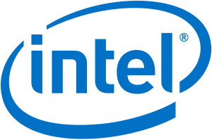
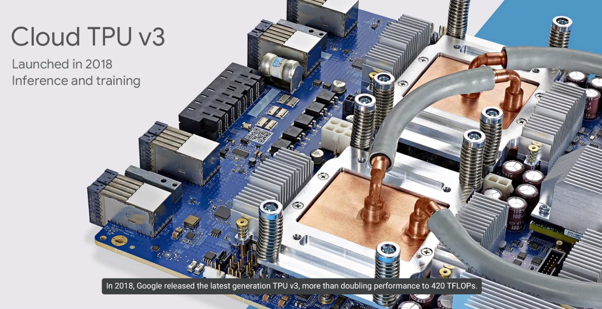
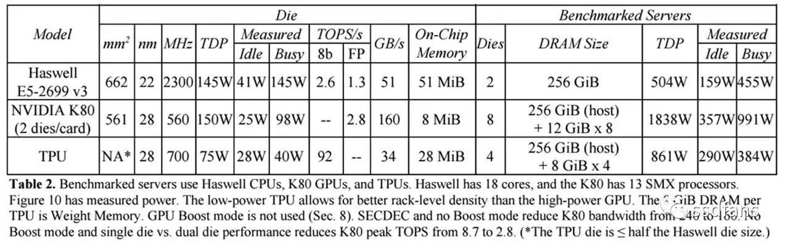
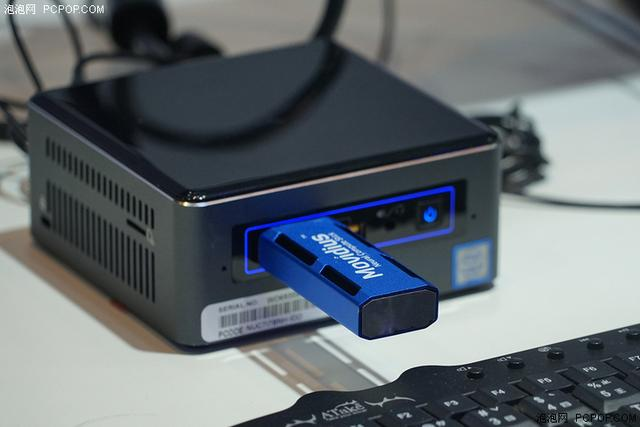
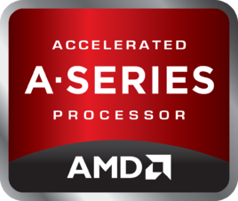
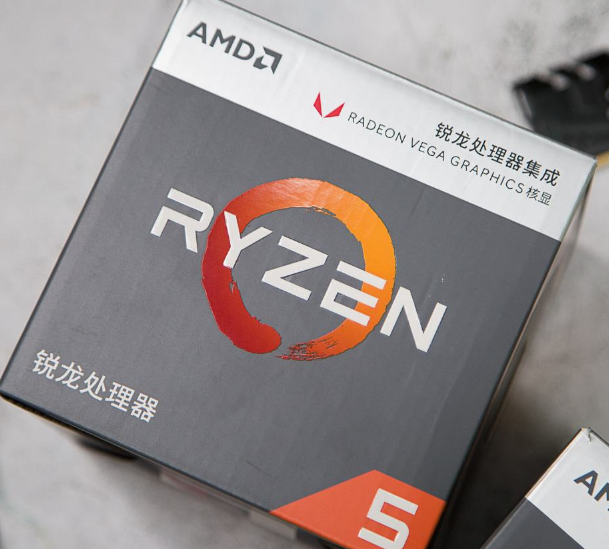

# xPUs

## GPU

Graphics, Parallel Computing, AI

### GPU, Parallel Computing, Heterogeneous and Hybrid Computing

Problems can be parallelized will benifit a lot from well parallelized algorithms and architectures.

	

Generally speaking, GPU is a more powerful architecture for parallel computing than CPU. A CPU consists of 1 to 64 CPU cores, while the GPU consists of hundreds of smaller cores. Together, they operate to crunch through the data in the application. This massively parallel architecture is what gives the GPU its high compute performance. There are a number of GPU-accelerated applications that provide an easy way to access high-performance computing (HPC).

	

The GPU accelerates applications running on the CPU by offloading some of the compute-intensive and time consuming portions of the code. The rest of the application still runs on the CPU. From a user's perspective, the application runs faster because it's using the massively parallel processing power of the GPU to boost performance. This is known as "heterogeneous" or "hybrid" computing.

### Key indicators

#### FLOPS

FLOPS is the abbreviation of *floating-point operations per second*. It is often used to estimate the execution efficiency of computers, especially in the field of scientific computing which uses a lot of floating point operations.

A GPU's compute ability can be mesured by FLOPS. There are benchmarks to mesure FLOPS of GPUs. In `CUDA`(a parallel computing platform for nvidia GPUs), FLOPS is mesured by algorithm below:

1. count the number of calculations per thread.
2. Multiply this value by the total number of threads you have.
3. Calculate the total time (using profiler or self-timer), divide the value in 2 (the number of times all threads calculate) by the calculation time, and you will get the number of calculations per second.

Because the values in 3 are often larger, we generally use `GFlops` to measure (Giga float operations per second), 1G operation = 10^9 operation.

#### Graphics memory size

Graphics memory, also known as frame buffer, is used to store rendering data processed or about to be extracted by graphics card chips. Like cache and memory for CPU, graphics memory is used to store graphical information to be processed. In non-graphics computing, it's used to cache variables for computing.

Generally speaking, the more memory a GPU card has, the better. Speed of the memory also matters. There are many kind of graphics memory, GDDR5 and HBM2 is the currently using technologies. Frequency and bandwidth is the most important indicators for graphics memory. HBM has much more bandwitdh(as the HBM is the short term for High Bandwitdh Memory), but it's more expensive than GDDR5 memory.

#### Stream Processors

GPU is consist of stream processors(SPs), for GPUs with same architecture, the more SPs it has, the more powerful it is. But that's not true for different architectures and different venders.

#### Gaming

A simple way to mesure the ability for gaming of a GPU is running a benchmark. The more score it gets, the more powerful it is.

### Venders

#### AMD

	

AMD's GPUs are generally cheaper than NVIDIA's GPUs when they have similar performance in graphics computing(mostly gaming). And due to AMD's drivers won't perform the best of a GPU's ability, they make the GPU larger(On a larger scale) than NVIDIA ones. Therefore AMD's GPUs have a higher FLOPS than NVIDIA ones at similar price. However, there are signs that the size of AMD's GPU is shrinking as RDNA architecture begins to replace the old GCN architecture.

As AI & Machine learning is in a hot phase, GPU has been widely used in this area because of its own characteristics. However, AMD's ROCm is only in its infancy.

#### NVIDIA

	

NVIDIA has the most powerful GPU in computing and gaming.

In graphics area, the new Turing architecture supports **Ray Tracing** functions for image processing and games while AMD currently have no corresponding productions.

In computing area, CUDA platform is widly used in general computing and is better supported by AI/Machine learning frameworks than AMD's ROCm.

#### Intel

	

Intel is the bigest GPU verder in the world, though its GPU has poor performance in gaming and computing compared to Nvidia and AMD's products, it's a huge success on bussines: integration of CPU and GPU. Because more than a half of computer users have no need for high-end GPUs.

## TPU

Universal tools are never as efficient as specialized tools.

### What's ASIC, what's TPU

#### ASIC

At present, ASIC is considered to be an integrated circuit designed for special purpose in the field of integrated circuits. It refers to the integrated circuits designed and manufactured according to the requirements of specific users and the needs of specific electronic systems. The characteristic of ASIC is to meet the needs of specific users. Compared with general integrated circuits, ASIC has the advantages of smaller volume, lower power consumption, higher reliability, better performance, better confidentiality and lower cost in mass production.

#### TPU

Tensor Processing Unit (TPU) is a customized ASIC chip designed by Google and dedicated to machine learning workloads. TPU provides computing support for Google's main products, including translation, photo, search assistant and Gmail. Cloud TPU uses TPU as an extensible cloud computing resource and provides computing resources for all developers and data scientists running cutting-edge ML models on Google Cloud. In Google Next'18, it's announced that TPU V2 is now widely used by users, including those who are free to try out, and that TPU V3 has now released an in-house beta.

	

#### How TPU work

If the image is a gray scale image of 28 *28 pixels, it can be transformed into a vector containing 784 elements. The neuron receives all 784 values and multiplies them with the parameter values (the red line shown above) so that it can be identified as "8". The function of parameter values is similar to extracting features from data by "filter", so the similarity between input image and "8" can be calculated.

	

The TPU then loads data from memory. When each multiplication is performed, the result is passed to the next multiplier and the addition is performed. So the result will be the sum of the product of all data and parameters. No memory access is required during the whole process of massive computation and data transfer.

This is why TPU can achieve high throughput in neural network computing, and at the same time, it has small energy consumption and physical space.

### Key indicators

TPU's computing ability can be measured by FLOPS, because TPU is currently only available from Google and has only three versions. We can refer to the official value of computing power given by Google.

Besides, TPU is mostly used in AI training, so we can mesure its ability by the time spent for traing a model to a sepecific accuracy. And we can make a comparison between the TPU platform and platform on other hardware.

	

The TeraOps/Watts of these chips are 30 to 80 times higher than other hardware according to Google.

### Venders

Currently only Google provides TPU-based services.

## HPU

Holographic Processing Unit

### CPU+GPU or HPU ?

The mode of CPU+GPU has been carried forward in the PC era, and has also been extended on mobile intelligent devices. On AR/VR devices, it is also a standard choice. But a simple GPU + CPU won't really meet the needs of VR / AR. 

AR needs to deal with artificial intelligence and computer vision problems, such as target recognition, location, tracking and modeling, with a large amount of computation. Especially when multi-modal interaction runs at the same time, image recognition, voice, gesture and other computations need a lot of computing resources, and existing chips may not be enough.

GPU's computing ability is really strong, throughput is huge and accuracy is high. But the real-time computing ability is not very good, a complex 3D graphics rendered on the AR/VR head display for a long time, resulting in too high delay, at this time it is easy to make people feel dizzy.

And GPU consumes a lot of power, so VR / AR devices may suffer form battery capacity.

When building the AR device--Hololens, Microsoft searched the commercial chips of the major manufacturers, but could not find the right ones, so they looked for TSMC to customize a chip designed for Hololens.

### Indicators

According to the information published by Microsoft, the processing ability of HPU reaches 1T (10^12) sub-pixel operation per second, but the power consumption is less than 10W. HPU can integrate input information from five cameras, a depth sensor and a motion sensor to compress and transmit the information to the main processor. In addition, HPU can also realize AI gesture recognition.

HPU has 24 Tensilica DSP cores, as well as up to 8MB Cache, in addition to the accelerator.

HPU is a kind of coprocessor. When encountering matrix operation of computer vision and convolution operation of neural network, HPU assists the main processor (CPU and integrated GPU) to complete these specific operations. And the accelerator integrated on HPU will also assist the main processor to complete various operations.

### Vender

Microsoft

### The new generation of HPU

The second generation of HoloLens is about to come out. It is said that it will be equipped with a new generation of HPU, and there will be a tremendous improvement.

## NPU

Neural network Processing Unit

### What's NPU

NPU, neural network processor, simulates human neurons and synapses at the circuit level, and directly processes large scale neurons and synapses with deep learning instruction sets. One instruction completes the processing of a group of neurons. 

Compared with the Von neumann structure, which has separated storage and computation units in CPU, NPU achieves the integration of storage and computation through synaptic weight, thus greatly improving the efficiency of operation. 

### Venders
The typical representatives of NPU are Cambrian chips in China and TrueNorth of IBM.

## VPU

	

The full name of VPU is Movidius visual processing unit. It has high speed visual computing performance and can process camera images, computer vision and deep learning in real time. Intel's positioning is service robots, UAVs, smart cameras, security monitoring, smart home, wearable devices and other fields.

The current form of VPU is a device of U disk size. It connects with the machine through USB 3.0 interface. Data processing and calculation are located in VPU, independent of CPU and GPU.

Intel technicians tell us that VPU is closer to GPU, it has efficient graphics processing capabilities, can handle multi-level images at the same time, but it is more focused and has lower power consumption than GPU. In DEMOs, VPU can recognize faces in complex images and compare them with the data learned beforehand, so as to recognize everyone.

If you have done deep learning in advance, then the operation of VPU can be achieved without the network, and it can be upgraded after data update. Intel believes that achieving AI without networking is the main reason it is better than voice assistants such as Amazon Alexa, because all computing can be implemented on the terminal, which reduces the process of data transmission and indirectly improves security compared with cloud computing.

### Vender

Moovidius Corp. (Intel)

## APU

### What's APU

CPU + GPU on one chip. It is a product provided by amd, which integrates GPU and CPU into a chip to reduce the volume and improve the integration. The performance of GPU in APU is much better than intel's GPU in their CPUs, so APUs are popular in specific areas

### Vender

AMD A-series and xxxG CPUs

	
	

