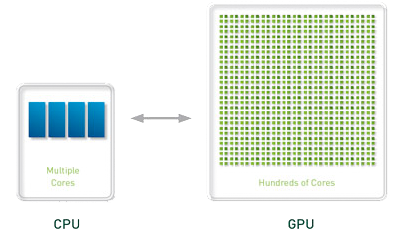
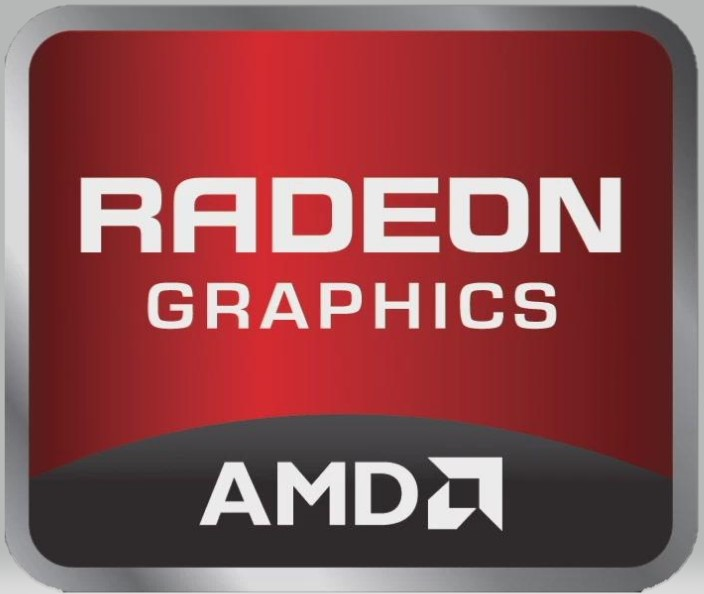
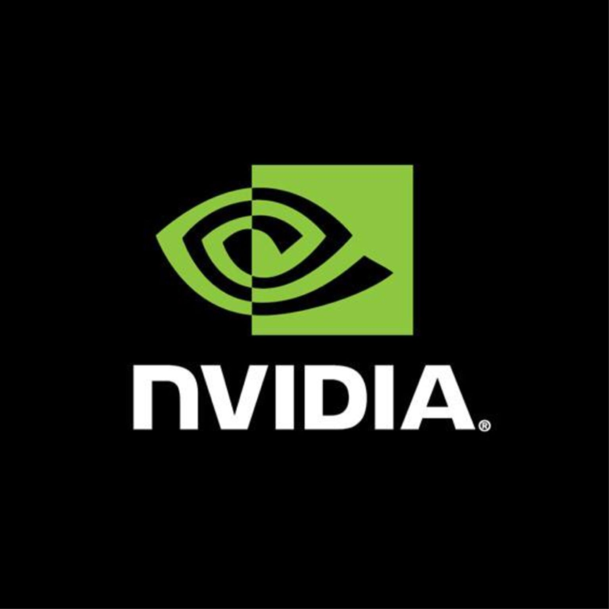

# xPUs

## GPU

Graphics, Parallel Computing, AI

### GPU, Parallel Computing, Heterogeneous and Hybrid Computing

Problems can be parallelized will benifit a lot from well parallelized algorithms and architectures.

	

Generally speaking, GPU is a more powerful architecture for parallel computing than CPU. A CPU consists of 1 to 64 CPU cores, while the GPU consists of hundreds of smaller cores. Together, they operate to crunch through the data in the application. This massively parallel architecture is what gives the GPU its high compute performance. There are a number of GPU-accelerated applications that provide an easy way to access high-performance computing (HPC).

	

The GPU accelerates applications running on the CPU by offloading some of the compute-intensive and time consuming portions of the code. The rest of the application still runs on the CPU. From a user's perspective, the application runs faster because it's using the massively parallel processing power of the GPU to boost performance. This is known as "heterogeneous" or "hybrid" computing.

### Key indicators

#### FLOPS

FLOPS is the abbreviation of *floating-point operations per second*. It is often used to estimate the execution efficiency of computers, especially in the field of scientific computing which uses a lot of floating point operations.

A GPU's compute ability can be mesured by FLOPS. There are benchmarks to mesure FLOPS of GPUs. In `CUDA`(a parallel computing platform for nvidia GPUs), FLOPS is mesured by algorithm below:

1. count the number of calculations per thread.
2. Multiply this value by the total number of threads you have.
3. Calculate the total time (using profiler or self-timer), divide the value in 2 (the number of times all threads calculate) by the calculation time, and you will get the number of calculations per second.

Because the values in 3 are often larger, we generally use `GFlops` to measure (Giga float operations per second), 1G operation = 10^9 operation.

#### Graphics memory size

Graphics memory, also known as frame buffer, is used to store rendering data processed or about to be extracted by graphics card chips. Like cache and memory for CPU, graphics memory is used to store graphical information to be processed. In non-graphics computing, it's used to cache variables for computing.

Generally speaking, the more memory a GPU card has, the better. Speed of the memory also matters. There are many kind of graphics memory, GDDR5 and HBM2 is the currently using technologies. Frequency and bandwidth is the most important indicators for graphics memory. HBM has much more bandwitdh(as the HBM is the short term for High Bandwitdh Memory), but it's more expensive than GDDR5 memory.

#### Stream Processors

GPU is consist of stream processors(SPs), for GPUs with same architecture, the more SPs it has, the more powerful it is. But that's not true for different architectures and different venders.

#### Gaming

A simple way to mesure the ability for gaming of a GPU is running a benchmark. The more score it gets, the more powerful it is.

### Venders

#### AMD

	

AMD's GPUs are generally cheaper than NVIDIA's GPUs when they have similar performance in graphics computing(mostly gaming). And due to AMD's drivers won't perform the best of a GPU's ability, they make the GPU larger(On a larger scale) than NVIDIA ones. Therefore AMD's GPUs have a higher FLOPS than NVIDIA ones at similar price. However, there are signs that the size of AMD's GPU is shrinking as RDNA architecture begins to replace the old GCN architecture.

As AI & Machine learning is in a hot phase, GPU has been widely used in this area because of its own characteristics. However, AMD's ROCm is only in its infancy.

#### NVIDIA

	

NVIDIA has the most powerful GPU in computing and gaming.

In graphics area, the new Turing architecture supports **Ray Tracing** functions for image processing and games while AMD currently have no corresponding productions.

In computing area, CUDA platform is widly used in general computing and is better supported by AI/Machine learning frameworks than AMD's ROCm.

## TPU

Universal tools are never as efficient as specialized tools.

### What's ASIC, what's TPU

application specific integrated circuit / Tensor Processing Unit

### Key indicators

ability in machine learning

### Venders

Google

## NPU

Neural network Processing Unit

## HPU

Microsoft

## VPU

Moovidius Corp.(Intel)

## MPU/MCU

## APU
