# Apollo

## Introduction

The growing popularity and diversity of data-parallel computation makes scheduling increasingly challenging. 

Apollo, a highly scalable and coordinated scheduling framework, performs scheduling decisions in a distributed manner, utilizing global cluster information via a loosely coordinated mechanism. 

Each scheduling decision considers future resource availability and optimizes various performance and system factors together in a single unified model. 

Apollo is robust, with means to cope with unexpected system dynamics, and can take advantage of idle system resources gracefully while supplying guaranteed resources when needed.

## Technical contributions

-  Apollo adopts a distributed and coordinated scheduling framework.
-  Apollo schedules each task on a server that minimizes the task completion time.
-  Apollo introduces a lightweight hardware-independent mechanism to advertise load on servers.
-  Apollo is made robust through a series of correction mechanisms that dynamically adjust and rectify suboptimal decisions at runtime.
-  Apollo introduces opportunistic scheduling.
-  Apollo is designed to support staged rollout to production clus-ters and validation at scale. 

  Apollo schedules over 20,000 tasks per second in a production cluster with over 20,000 machines. It also delivers high scheduling quality, with 95% of regular tasks experiencing a queuing delay of under 1 second, while achieving consistently high (over 80%) and balanced CPU utilization across the cluster.

## Scheduling

Figure below shows a sample execution graph in SCOPE, greatly simplified from an important production job that collects user click information and derives insights for advertisement effectiveness.

	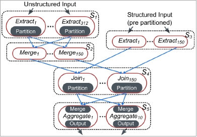

 Conceptually, the job performs a join between an unstructured user log and a structured input that is pre-partitioned by the join key. 
 
 The plan first partitions the unstructured input using the partitioning scheme from the other input: stages S1 and S2 respectively partition the data and aggregate each partition. 
 
 A partitioned join is then performed in stage S4. The DOP is set to 312 for S1 based on the input data volume, set to 10 for S5, and set to 150 for S2, S3, and S4.

### Essence of Job Scheduling

- Ready List
  
  Maintain a list of tasks that are ready to be scheduled.

- Task Priority
  
  Sort the ready list appropriately.

- Capacity Management
  
  Manage the capacity assigned to the job and decide when to schedule a task based on the capacity management policy.
  
- Task Scheduling
  
  Decide where to schedule a task and dispatch it to the selected server.
  
- Failure Recovery
  
  Monitor scheduled tasks, initiate recovery actions when tasks fail, and mark the job failed if recovery is not possible.
  
- Task Completion
  
  Check its dependent tasks in the execution graph and move them to the ready list if all the tasks that they depend on have completed.
  
- Job Completion
  
  Repeat the whole process until all tasks in the job are completed.

### Capacity Management and Tokens

- Token-Based Mechanism

  The system uses a token-based mechanism to allocate capacity to jobs. 
  
  Each token is defined as the right to execute a regular task, consuming up to a predefined amount of CPU and memory, on a machine in the cluster.

- Virtual Cluster
  
  Virtual cluster management utilizes various admission control policies and decides how and when to assign its allocated tokens to submitted jobs.

  A virtual cluster is created for each user group for security and resource sharing reasons. 
  
  Each virtual cluster is assigned a certain amount of capacity in terms of number of tokens, and maintains a queue of all submitted jobs.

## The Apollo Framework

Figure below provides an overview of Apollo’s architecture.

	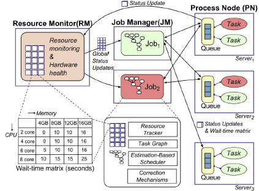

- Job Manager (JM) is assigned to manage the life cycle of each job. 

- Global cluster load information used by each JM.

- Process Node (PN) process is responsible for managing the local resources and performing local scheduling.

- Resource Monitor (RM) aggregates load information from PNs across the cluster continuously.

### PN Queue

The PN on each server manages a queue of tasks assigned to the server in order to provide projections on future resource availability. 

- When a JM schedules a task on a server, it sends a task-creation request.

- Once a task creation request is received, the PN copies the required files to a local directory.

- The PN monitors CPU and memory usage, considers the resource requirements of tasks in the queue, and executes them when the capacity is available. 

- The PN provides feedback to the JM to help improve accuracy of task runtime estimation.

- The PN further exposes the load on the current server to be aggregated by its RM.

The use of task queues enables schedulers to dispatch tasks to the PNs proactively based on future resource availability, instead of based on instantaneous availability.

### Wait-Time Matrix

Wait-time matrix, with each cell corresponding to the expected wait time for a task that requires a certain amount of CPU and memory. 

- The PN maintains a matrix of expected wait times.

- The PN updates this matrix frequently.

- The PN sends this matrix, along with a timestamp, to every JM.

- The PN sends the matrix to the RM using a heartbeat mechanism.

### Estimation-Based Scheduling

Apollo has to consider a variety of factors and does so in a single unified model using an estimation-based approach. The followings are important part to make scheduling.

- Completion Time Estimation
  
- Task Priorities

- Stable Matching

### Correction Mechanisms

Due to the distributed nature of the scheduling, several JMs might make competing decisions at the same time. In addition, the information
used might be stale; the task wait time and runtime might be under or overestimated. 

Apollo has built-in mechanisms to address those challenges and dynamically adjust scheduling decisions with new information. 

Apollo optimistically defers any correction until after tasks are dispatched to PN queues. 

- Duplicate Scheduling

- Randomization

- Confidence

- Straggler Detection

### Opportunistic Scheduling

Opportunistic scheduling is introduced in Apollo to gracefully take advantage of idle resources whenever they are available. 

Tasks can execute either in the regular mode or in the opportunistic mode.

Apollo uses randomized allocation to achieve probabilistic resource fairness for opportunistic tasks. 

In addition, Apollo upgrades opportunistic tasks to regular ones when tokens become available and assigned.

- Randomized Allocation Mechanism

- Task Upgrade

## Evaluation

### Apollo at Scale

	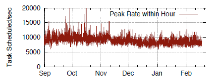

Figure above shows the peak scheduling rates for each hour over the past 6 months, highlighting that Apollo can constantly provide a scheduling rate of above 10,000, reaching up to 20,000 per second in a single cluster.

	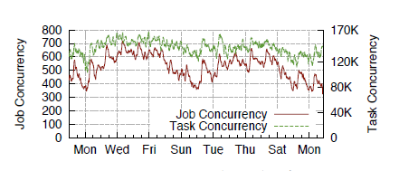

Figure above shows the number of concurrently running jobs and their tasks in the cluster.

	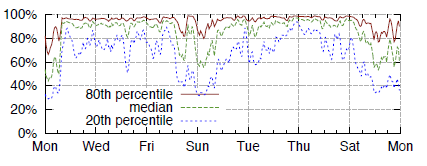

Figure above shows server CPU utilization in the same period, both sampled at every 10 seconds. 

	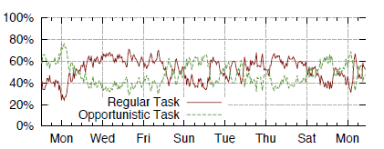

Figure above shows the percentage of CPU hours attributed to regular and opportunistic tasks.

Those results show that Apollo is highly scalable, capable of scheduling over 20,000 requests per second, and driving high and balanced system utilization while incurring minimum syqueuing time.

### Scheduling Quality

	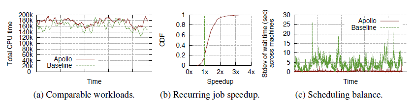

Figure(a) above shows the recurring nature of the workload produced a strong correlation in CPU time between the workloads in the two time frames.

Figure(b) above shows the CDF of the speedups for all recurring jobs and it
indicates that about 80% of recurring jobs receive various degrees of performance improvements (up to 3x in speedup) with Apollo. 

Figure(c) above shows the standard deviation of the average task queue time across servers, comparing Apollo with the baseline scheduler, which indicates clearly that Apollo achieves much more balanced task queues across servers.

	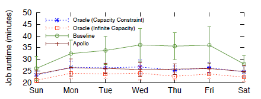

Figure above shows job performance using Apollo and the baseline scheduler, respectively, and compares them with the oracle scheduler using runtime traces.

Those results show that Apollo delivers excellent job performance compared with the baseline scheduler and its scheduling quality is close to the optimal case.

### Evaluating Estimates

	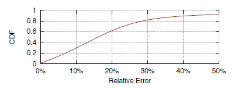

Figure above shows the CDF of the estimation error for task CPU time.

	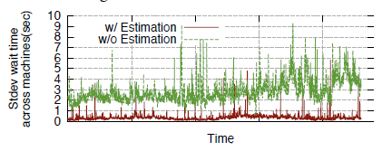

Figure above shows the distributions of task queuing time.

Apollo provides good estimates on task wait time and CPU time, and estimation does help improve scheduling quality. 

### Correction Effectiveness

Table below evaluates different heuristics of duplicate scheduling.

	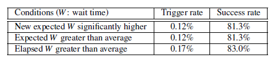

Apollo’s correction mechanisms are shown effective with small overhead.

### Stable Matching Efficiency

	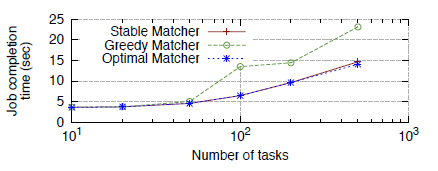

Figure above shows that the stable matching algorithm performs within 5% of the optimal matching under the simulated conditions while the greedy approach, which schedules tasks one at a time on the server with the minimum expected completion time, was 57% slower than the optimal matching.

Apollo’s matching algorithm has the same asymptotic complexity as a naive greedy algorithm with negligible overhead. It performs significantly better than the greedy algorithm and is within 5% of the optimal scheduling in our simulation.

