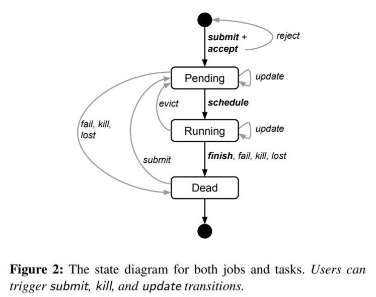
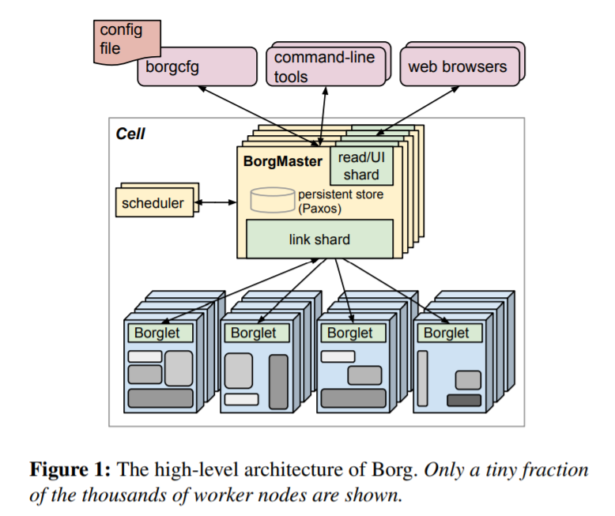
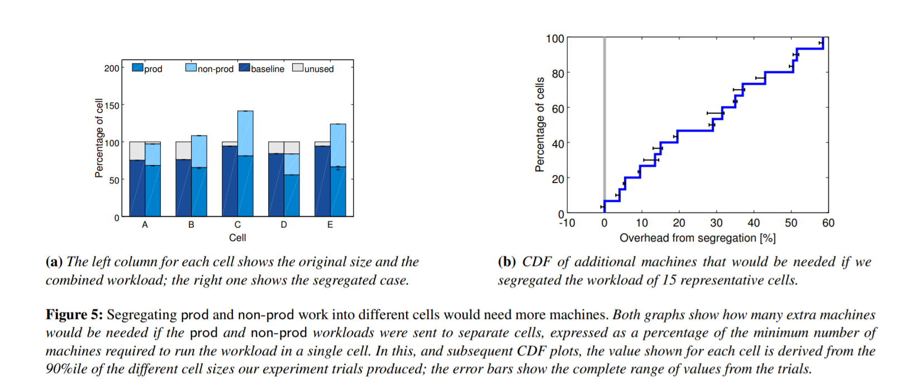
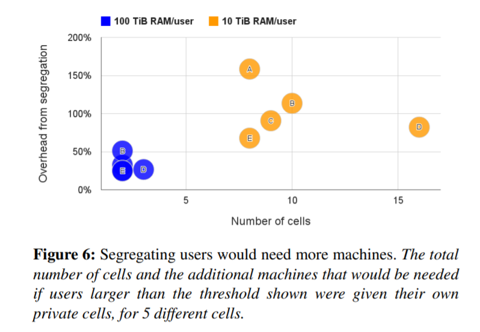
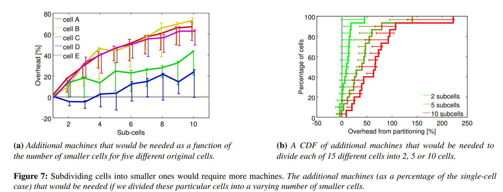
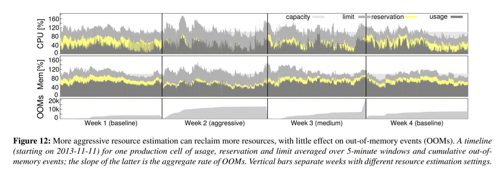

# Borg

> Read by Liu Qingyuan

## Introduction

* Three Benefits
  1. hides the details of resource management and failure handling so its users can focus on application development instead.
  
  2. operates with very high reliability and availability, and supports applications that do the same 
  
  3. lets us run workloads across tens of thousands of machines effectively. 
  
     The user perspective

### Workload
* Long running jobs
* Batch jobs
* `prod` & `non-prod`

* Clusters and cells

  The machines in a cell belong to a single cluster.
### Jobs and tasks

  * Job properties: name, owner, number of tasks it has.

  * Job can constraint its tasks to run on machines with particular attributes

  * Each task maps to a set of Linux processes running in a container on a machine.

  * Task properties: e.g. resource requirements, task's index within the job.

  * Users operate on jobs by issuing RPC  to Borg, mostly from a command-line tool.

  * Properties of some or all of the tasks can be updated in a running job by pushing a new job configuration to Borg. Updates are generally done in a rolling fashion, and a limit can be imposed on the number of task disruptions an update causes.

    

### Allocs

`Alloc` is a reserved set of resources on a machine in which one or more tasks can be run; the resources remain assigned whether or not they are used.

Usage:
    1. Set resources aside for future tasks
        2. retain resources between stopping a task and starting it again
        3. gather tasks from different jobs onto the same machine.

### Priority, quota, and admission control

  - Every job has a `priority`, a small positive integer. High priority task can obtain resources at the expense of a lower priority one, even if that involves preempting the latter.
  - To avoid **preemption cascade**，tasks in the `production` priority are disallowed to preempt one another.
  - `Quota` is used to decide which jobs to `admit` for scheduling. `Quota` is expressed as a vector of resource quantities (CPU, RAM, etc) at a given priority, for a period of time ( typically months). The quantities specify the maximum amount of resources that a user's job requests can ask for at a time. Quota-checking is part of admission control.
  - High priority `quota` costs more.
  - `Quota allocation` is handled outside of Borg, and is intimately tied to our physical capacity planning, whose results are reflected in the price and availability of quota in different datacenters. User jobs are admitted only if they have sufficient quota at the required priority.

### Naming and monitoring

  * Borg create a stable **Borg name service(BNS)** name for each task that includes the cell name, job name, and task number.
  
  * Almost every task run under Borg contains a built-in HTTP server that publishes information about the health of the task and thousands of performance metrics. Borg monitors the health-check URL.
  
  * A service called Sigma provides a web-based UI through which a user can monitor the state of their jobs and many other information.
  
  * Borg records all job submissions ,task events, and detailed per-task resource usage information in `Infrastore`

##  Borg architecture

 
## Borgmaster

2 components:

1. Main Borgmaster process
2. A separate scheduler

Main Borgmaster:

* Handles client RPCs that:

  * mutate state (e.g create job)

  * Provide read-only access to data (lookup job)
* Manages state machines for all of the objects in the system (machines, tasks, allocs, etc.)
* Communicates with Borglets
* Offers a web UI as a backup to Sigma
* Replicate 5 times. Each replica maintains an in-memory copy of most of the state of the cell, and this state is also recorded in a highly-available, distributed, Paxos-based store on the replica's local disks.
* A single elected (using Paxos) master per cell serves both as the Paxos leader and the state mutator, handling all operations that change the cell's state.  After it is elected, it acquires a lock from `Chobby` so that other systems can find it. It takes 10s to about a minute from a failing leader to a newly elected leader.

Checkpoints: The Borgmaster's state at a point in time, and takes the form of a periodic snapshot plus a change log kept in the Paxos store. It can be used including:

* Restore the Borgmaster's state to an arbitrary point in the past.

* Fixing it by hand in extremis

* Building a persistent log of events for future queries

* Offline simulations.

  ...

### Scheduling

When a job is submitted, the Borgmaster records it persistently in the Paxos store and adds the job's tasks to the pending queue. This is scanned asynchronously by the scheduler, which assign tasks to machines if there are sufficient available resources that meet the job's constraints.

(The scheduler primarily operates on tasks, not jobs.)

Two parts: *feasibility checking* and *scoring* .

* Feasibility checking:   

  Find the machines that meet the task's constraints and also have enough available resources.
  
* Scoring

  The scheduler determines the goodness of each feasible machines, but is mostly driven by built-in criteria, such as minimizing the number and priority of preempted tasks, picking machines that already have a copy of the task's packages, spreading tasks across power and failure domains, and packing quality including putting a mix of high and low priority tasks onto a single machine to allow the high-priority ones to expand in a load spike.
  
  Two strategies of scoring are used:
  
  * Worst fit: try to spread the tasks across all the machines, leaving headroom for load spikes, but at the expense of a increasing segment.
  
  * Best fit: try to spread the tasks as tight as possible. This hurt applications with bursty loads, particularly bad for batch jobs
  
  * Hybrid: provides about 3%-5% higher performance.
  
  Machines selected by scoring do not have enough space: kill the processes from low priority to high priority and add it to the pending queue instead of migrate or hibernate them.
  

Tasks startup latency: median typically about 25s. Package installation takes 80%. Scheduler prefers to assign a new tasks to machines that already have the packages. In addition, Borg distributes packages to machines in parallel using tree and torrent-like protocols.

  ### Borglet

  A local Borg agent presented on every machine in a cell. It can: 

  * start and stops tasks;
  * restart them if they fail; 
  * manages local resources by manipulating OS kernel settings;
  * rolls over debug logs, and reports the state of the machine to the Borgmaster and other monitoring systems.

  The Borgmaster polls each Borglet every few seconds to retrieve the machine's current state and send it any outstanding requests.

  If a Borglet does not respond to several poll messages its machine is marked as down and any tasks it was running are rescheduled on other machines.

  The elected master is responsible for preparing messages to send to the Borglets and for updating the cell's state responses. For performance scalability, each Borgmaster replica runs a stateless link shard to handle the communication with some of the Borglets. 

  ### Scalability

  Not sure the ultimate scalability limit to Borg's centralized architecture will come from. A single Borgmaster can manage many thousands of machines in a cell, and several cells have arrival rates above 10000 tasks per minute. 

  Scheduler is split into a separate process so it could operate in parallel for better performance

  Other techniques used to make the Borg scheduler more scalable:

  * Score caching.
  
  * Equivalence classes
  
  * Relaxed randomization

## Availability

Tasks that run on Borg should handle the eviction events, using techniques such as replication. Even so, Borg try to mitigate the impact of these events by: 

* Automatically reschedules evicted tasks, on a new machine if necessary.
* reduces correlated failures by spreading tasks of a job across failure domains such as machines, racks and power domains.
* limits the allowed rate of task disruptions and the number of tasks from a job that can be simultaneously down during maintenance activity such as OS or machine upgrades.
* uses declarative desired-state representations and idempotent mutating operations.
* rate-limits finding new places for tasks from machines that become unreachable, because it cannot distinguish between large-scale machine failure and a network partition.
* recovers critical intermediate data written to local disk by repeatedly re-running a logsaver task, even if the `alloc` it was attached to is terminated or moved to another machine.

A key design feature is that already-running tasks continue to run even if the Borgmaster or a task's Borglet goes down.

Borgmaster is able to achieve 99.99% availability in practice.

## Utilization

### Evaluation Methodology

Cell Compaction: the minimum size of a cell that could fit a given workload.

### Cell Sharing

Segregated `prod` and `non-prod` work would need 20% more machines.

What's more, cells shared by users whose memory use is less than 10TB performs worse than cells shared by those whose memory use is less than 100TB, which means that cells should be shared by more users. Once again, pooling resources significantly reduces costs.

Other experiments shows that sharing the workloads may cause CPU interference and thus affect the performance.  The CPI is used to quantify the influence.

* The CPI of a task increases about 0.3% when a new task is allocated, and increasing CPU usage by 10% will cause the increase of CPI by less than 2%
* A mean CPI in shared cells of 1.58 whereas a mean of 1.53 in dedicated cells - i.e., CPU performance is about 3% worse in shared cells
* To avoid the difference of applications in different cells, the CPI of the borglet is also evaluated. The CPI of borglet is 1.20 in dedicated cells and 1.43 in shared ones, which means it runs 1.19* faster in a dedicated cell.

### Large Cells

Using smaller cells would require significantly more machines:

### Fine-grained resource requests

The granularity of the resources requests is units of milli-cores of CPU and bytes of memory or disk space, which could help to improve the performance.

### Resource Reclamation

The unused but required resources by users can be utilize by Borg to run lower-quality resources, such as batch jobs. 

 A machine may run out of resources at runtime if the reservations (predictions) are wrong – even if all tasks use less than their limits. If this happens, `non-prod` tasks are killed or throttled, never `prod` ones.

## Isolation

Good mechanisms are required to prevent tasks from interfering with one another while multiple tasks are running in the same machine simultaneously. 

### Security Isolation

`chroot` and `cgroup` as the primary secure isolation mechanism. 

VMs and security sandboxing techniques are used to run external software. Borg run each hosted VM in a KVM process that runs as a Borg task

### Performance Isolation

All borg tasks run inside a Linux cgroup-based resource container and the Borglet manipulates the container settings, giving much improved control because the OS kernel is in the loop.

Borg tasks also have an application class or `appclass` to support overload and overcommitment. The most important distinction is between the *latency-sensitive*(LS) appclasses and batch. (That is long-running jobs and batch jobs)

A second split is between *compressible resources* (CPU cycles, disk I/O bandwidth) that are rate-based and can be reclaimed from a task without killing it. *Non-compressible* resources which generally cannot be reclaimed without killing the task. 

If a machine runs out of non-compressible resource, the Borglet immediately terminates tasks, from lowest to highest priority. If the machine runs out of compressible resources, the Borglet throttles usage (favoring LS jobs) so that short load spikes can be handled without killing any tasks.

To reduce scheduling delays, Borg also propose their own version of CFS used to extended per-cgroup load history, allows preemption of batch tasks by LS tasks, and reduces the scheduling quantum when multiple LS tasks are runnable on a CPU. 