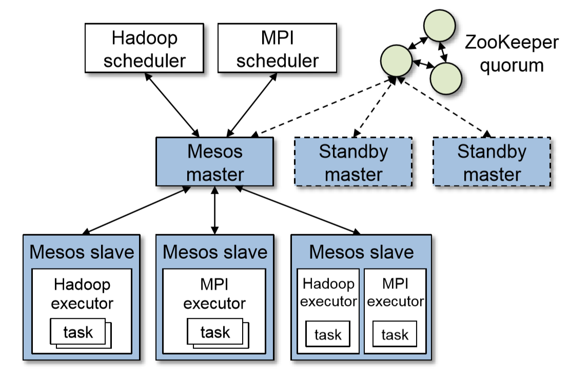
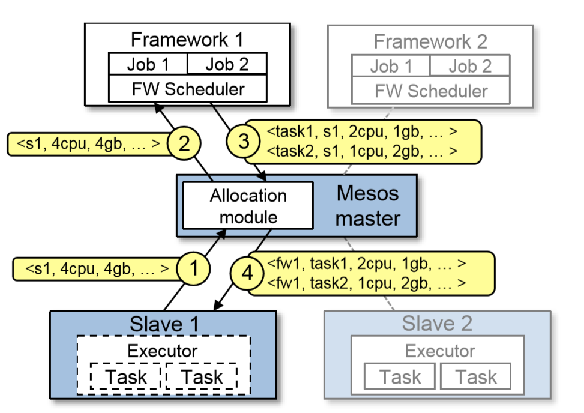
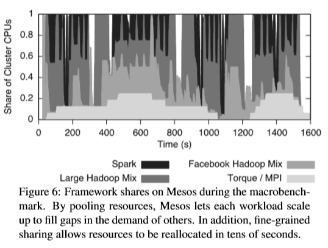
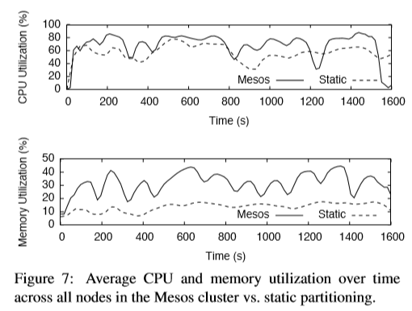
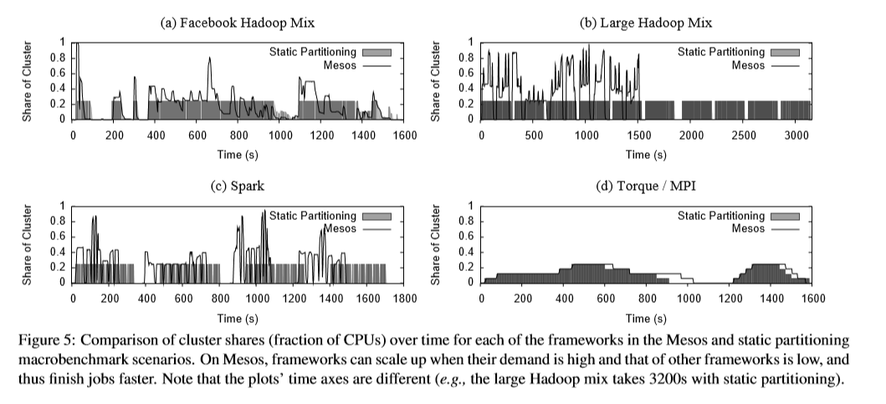
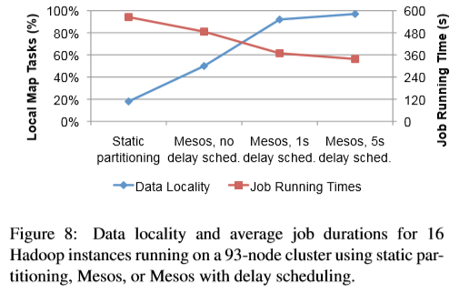

# Mesos

> Read by Jing Jiazhen

## Problems

Clusters of commodity servers have become a major computing platform, researchers and practitioners have been developing a diverse array of cluster computing frameworks to simplify programming the cluster. But, no framework will be optimal for all applications.

Therefore, organizations will want to run multiple frameworks in the same cluster, picking the best one for each application. Multiplexing a cluster between frameworks improves utilization and allows applications to share access to large datasets that may be too costly to replicate across clusters.

This paper describes the mesos， whihc is aim to solve the problem: how to run a variety of computing frameworks on a cluster, and achieve efficient scheduling algorithm, with scalability, high fault tolerance and high availability.

Mesos is a thin resource sharing layer. By providing a common interface to access cluster resources, it is possible to achieve fine-grained sharing in a diversified cluster computing framework.

## How to solve the problems

### Core idea

In essence, mesos is a **two-level** distributed resource scheduling framework. **The framework itself is not responsible for the final specific scheduling of resources, but rather the scheduling logic of the specific computing framework.** Different computing frameworks can have their own scheduling logic. Of course, mesos still needs to be responsible for submitting available resources to various scheduling frameworks for their scheduling, so strictly speaking, it also undertakes the task of pre scheduling.

### Design Philosophy

**Mesos aims to provide a scalable and resilient core for enabling various frameworks to efficiently share clusters.** Because cluster frameworks are both highly diverse and rapidly evolving, the overriding design philosophy has been to define a minimal interface that enables efficient resource sharing across frameworks, and otherwise push control of task scheduling and execution to the frameworks. Pushing control to the frameworks has two benefits. First, it allows frameworks to implement diverse approaches to various problems in the cluster (e.g., achieving data locality, dealing with faults),and to evolve these solutions independently. Second, it keeps Mesos simple and minimizes the rate of change required of the system, which makes it easier to keep Mesos scalable and robust.

### Details

#### Architecture

	

The figure shows the main components of Mesos. Mesos consists of a master process that manages slave daemons running on each cluster node, and frameworks that run tasks on these slaves. The master implements fine-grained sharing across frameworks using resource offers. Each resource offer is a list of free resources on multiple slaves. The master decides how many resources to offer to each framework according to an organizational policy, such as fair sharing or priority. To support a diverse set of inter-framework allocation policies, Mesos lets organizations define their own policies via a pluggable allocation module. Each framework running on Mesos consists of two components: a scheduler that registers with the master to be offered resources, and an executor process that is launched on slave nodes to run the framework’s tasks. While the master determines how many resources to offer to each framework, the frameworks’ schedulers select which of the offered resources to use. When a framework accepts offered resources, it passes Mesos a description of the tasks it wants to launch on them.

	

This figure shows an example of how a framework gets scheduled to run tasks. In step (1), slave 1 reports to the master that it has 4 CPUs and 4 GB of memory free. The master then invokes the allocation module, which tells it that framework 1 should be offered all available resources. In step (2), the master sends a resource offer describing these resources to framework 1. In step (3), the framework’s scheduler replies to the master with information about two tasks to run on the slave, using (2 CPUs,1 GB RAM) for the first task, and (1 CPUs,2 GB RAM) for the second task. Finally, in step(4), the master sends the tasks to the slave, which allocates appropriate resources to the framework’s executor, which in turn launches the two tasks (depicted with dotted borders). Because 1 CPU and 1 GB of RAM are still free, the allocation module may now offer them to framework 2. In addition, this resource offer process repeats when tasks finish and new resources become free.

#### Resource Allocation

Mesos delegates allocation decisions to a pluggable allocation module, so that organizations can tailor allocation to their needs. So far, Mesos have implemented two allocation modules:

1. Performing fair sharing based on a generalization of max-min fairness for multiple resources

2. Strict priorities. Similar policies are used in Hadoop and Dryad.

When the cluster is full of long jobs (such as search engine or ticketing system), the cluster resources are nearly exhausted, and mesos can kill some tasks to release resources. Mesos will first request the executor on some nodes to kill tasks, which will produce two results:

1. The executor successfully executes the command of mesos, killing specific tasks.

2. The executor is indifferent to the requests of mesos, which will kill the whole executor and all the tasks running on it.

For the special framework of some tasks that cannot be killed, such as MPI, mesos will set a guaranteed allocation resource to it, and these resources cannot be deprived until the end of its operation. When its resources are higher than a guaranteed allocation, any of its tasks can be killed; otherwise, its tasks cannot be killed.

#### Isolation

* The currently isolate resources using OS container technologies, specifically Linux Containers and Solaris Projects.

#### Making Resource Offers Scalable and Robust

Mesos includes three mechanisms to help with this goal.

1. Some frameworks will always reject certain resources, So Mesos lets them short-circuit the rejection process and avoid communication by providing filters to the master. Currently there are two types of filters: **“only offer nodes from list L”** and **“only offer nodes with at least R resources free”**. However, other types of predicates could also be supported. Note that unlike generic constraint languages, filters are Boolean predicates that specify whether a framework will reject one bundle of resources on one node, so they can be evaluated quickly on the master. Any resource that does not pass a framework’s filter is treated exactly like a rejected resource.

2. Because a framework may take time to respond to an offer, Mesos counts resources offered to a framework towards its allocation of the cluster. This is a strong incentive for frameworks to respond to offers quickly and to filter resources that they cannot use.

3. If a framework has not responded to an offer for a sufficiently long time, Mesos rescinds the offer and re-offers the resources to other frameworks.

In summary, the framework can set filters to filter the resource invitations sent by the master to get the most suitable resources. Mesos records the use of cluster resources by the framework, so that when providing resources for the framework next time, the number of resources provided and other attributes are more suitable for the needs of the framework, so as to make the framework respond to resource invitation faster.

#### Fault Tolerance

Since all the frameworks depend on the Mesos master, it is critical to make the master fault-tolerant. To achieve this, the master is designed to be soft state, so that a new master can completely reconstruct its internal state from information held by the slaves and the framework schedulers.

In particular, the master’s only state is the list of active slaves, active frameworks, and running tasks. This information is sufficient to compute how many resources each framework is using and run the allocation policy.

Multiple masters will be run in a hot-standby configuration using ZooKeeper for leader election. When the active master fails, the slaves and schedulers connect to the next elected master and repopulate its state.

Aside from handling master failures, Mesos reports node failures and executor crashes to frameworks’ schedulers. Frameworks can then react to these failures using the policies of their choice.

Finally, to deal with scheduler failures, Mesos allows a framework to register multiple schedulers such that when one fails, another one is notified by the Mesos master to take over. Frameworks must use their own mechanisms to share state between their schedulers.

## How better it will be

### Definitions, Metrics and Assumptions

Mesos divides the computing framework into two categories:

1. Eastic. For example, Hadoop can start running tasks as long as it gets some required resources, and once a task is completed, it can release the resources occupied by the task.

2. Rigid. For example, MPI must obtain all the resources it needs before it can start the task running. It must also release the resources it holds after all the tasks have finished running.

On the other hand, according to the requirements of the framework, the resources of the cluster are divided into two categories:

1. Mandatory. The resource is necessary when the framework is running. If GPU is required when a framework is running a job, then this resource requirement is mandatory, and mesos must provide GPU to it.

2. Preferred. The preferred resource is that the framework will make the job run faster with it, but at the same time, this resource is not necessary and can be made up by other ways.

Slots in mesos and Hadoop 1.0 are different concepts. Slots in mesos refer to a collection of machines, not the number of CPUs or memories.

Framework ramp up time refers to the maximum time for a framework to acquire resources.

Job completion time refers to job running time.

	

In system utilization, because the elastic framework can run tasks as long as it gets resources (either partially or completely), and the rigid framework must get all the required resources before it can start running tasks, the resource utilization of the elastic framework can reach 100%, while the rigid framework only waits for resources not to run jobs. In the blank period, the resources obtained in the blank period have not been utilized, resulting in low utilization rate of resources. In my opinion, the longer the blank period is, the lower the resource utilization of rigid framework is.

### Benchmark

#### Method

The author evaluated Mesos through a series of experiments on the Amazon Elastic Compute Cloud (EC2). We begin with a macro benchmark that evaluates how the system shares resources between four workloads, and go on to present a series of smaller experiments designed to evaluate overhead, decentralized scheduling, their specialized framework (Spark), scalability, and failure recovery.

In order to evaluate the main purpose of measurement, that is to make multiple cluster frameworks share clusters efficiently, they run a macro benchmark including four kinds of load mix.

* A Hadoop instance, running a mixture of small jobs and large jobs based on the workload on Facebook.
* A Hadoop instance running a series of large batch jobs.
* Spark, running a series of machine learning jobs.
* Torque, running a series of MPI jobs.

They compare the application scenarios of using fair sharing to run four cluster frameworks as workload on 96 node mesos cluster with the application scenarios of static allocation for each framework (one cluster framework has 24 nodes), and test the response time and resource utilization of the jobs on two test cases. They use EC2 nodes, each node has 4 CPU cores and 15GB ram.

#### Result

	

They show in Figure 6 the ratio of CPU cores that mesos allocates to each cluster framework over a period of time. You can see that mesos enables each cluster framework to expand when other cluster frameworks have low demand, and therefore makes cluster nodes busy. For example, at 350 hours, when the spark and Facebook Hadoop cluster framework does not run jobs, torque is using 1 / 8 of the cluster's resources, while the big job Hadoop cluster framework has expanded to 7 / 8 of the cluster. And you can see that due to the fine-grained nature of tasks, resources are reallocated quickly. (in about 360 hours, when the Facebook Hadoop job starts).

	

Finally, higher allocation of node resources is translated into higher CPU and memory utilization. (CPU increased by 10% and memory increased by 17%), as shown in Figure 7.

	

The second problem is how well jobs run in the context of mesos than in the case of static allocation clusters. They show this data in two ways. First, figure 5 compares the resource allocation of each cluster framework in a shared and static allocation cluster over a period of time. The shaded part represents the resource allocation in the static allocation cluster, and the solid line area represents the resources shared on the mesos. It can be seen that when the overall demand allows, the fine-grained cluster framework (Hadoop and spark) has expanded to more than 1 / 4 of the cluster by means of mesos. As a result, jobs are submitted faster on mesos. At the same time, torque completes the similar resource allocation and job running period under mesos.

	

Second, tables 4 and 5 illustrate the changes in job efficiency for each cluster framework. In Table 4, they compare the overall performance of each cluster framework, which is defined as the sum of the job run times in the static allocation cluster and the mesos scenario. You can see that Hadoop and spark jobs run faster on the whole on mesos, while torque slightly slows down. The cluster framework that gets the biggest improvement is the big job hybrid Hadoop, which always has tasks to run, and will fill in the gap of other cluster framework requirements. This cluster framework shows twice the efficiency improvement on mesos.

	

Table 5 compares the results more specifically in type. Two noteworthy trends can be observed. First of all, in the Facebook Hadoop hybrid test, small jobs run worse on mesos. This is because of the interaction between the fair share on Hadoop (between its jobs) and the fair share on mesos (between different cluster frameworks): during the period when Hadoop owns 1 / 4 of the cluster's resources, Hadoop will have a delay in getting a new resource offer (because any emptied resources will be allocated to the furthest cluster framework shared with it). So in this period of time, any submitted small job will be delayed for a long time compared with its running time. On the contrary, when running alone, Hadoop can provide resources for new jobs as soon as any task ends. This hierarchical fair sharing problem will also appear in network, which can be alleviated by running small jobs in an independent cluster framework or using different allocation strategies. (for example, using lottery scheduling instead of providing all the cleaned up resources to the cluster framework with the least sharing)

Finally, torque is the only cluster framework that performs worse on average on mesos. Large Tachyon jobs take an average of 2 minutes, while small jobs take an average of 20 seconds. This delay is due to the fact that 24 tasks have to wait to be started on the mesos before starting each job, but the average time spent is 12 seconds. It can be believed that the remaining delay is due to "outdated nodes". (slow nodes). When you run torque alone, two jobs take 60 seconds longer than the others. They found that the two jobs used a slower node running single node benchmark (in fact, Linux reported a 40% lower bogomips). Because Tachyon commits an equal amount of work on each node, it will be as fast as the slowest node

### Locality

	

## 自己的思考

1
