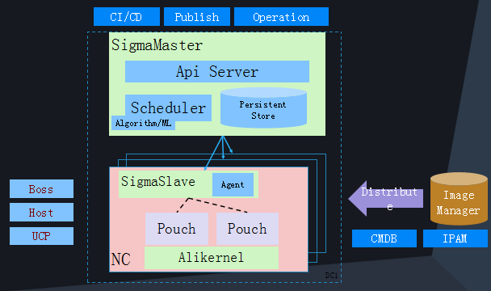

# Sigma

Because sigma culster schuduler is not published yet by Alibaba, and there are no papers or official documents for it, I can only investgate it by articles and news on the internet.

## Components of Sigma Culster Schuduler

The Sigma Culster Schuduler are mainly divided into three parts:
- SigmaMaster
- SigmaSlave
- AliKernel

The framework is as the picture shown below.

AliKernel is deployed on each NC, enhancing the kernel, making it flexible to execute tasks and change strategies.

SigmaSlave is able to distribute computing resources, and handle emergency occasions.

SigmaMaster is the master of the culster, which can schedule and distribute resources and make policies.

## Cooperate with Fuxi System

The picture shown below is the hybrid framework of *Sigma* and *Fuxi*.

The hybrid framework can do online job and computing job on the server. When the traffic is not busy, server can divide time slice to do computing job; when busy traffic arrives, server can schedule resources the handle requests(online job).

Because of no detail implementations of scheduling, there are no algorithms  available.
