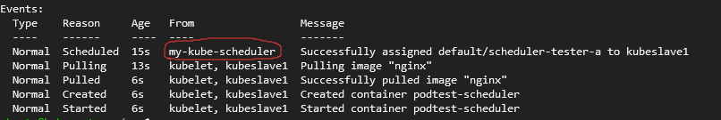

# Some notes for Kubernetes starters

This md is to introduce some basic commands for using a kubernetes cluster.

Written by Jiazhen Jing, for any questions you can contact me.

## SSH

`ssh ubuntu@202.120.40.8 -p 30250 -i sshkey`

## Kubectl

This is the main tool to use the cluster.

### Get

`kubectl get [resource kind] [-n namespace]`

this will show the resources of provided kind in provided namespace. Note that `[-n namespace]` is optional, the default is `default`, and `-A` means to show resources of all namespaces.

For this assignment, `kube-system` is the most likely used namespace. As the scheduler should be in kube-system namespace.

examples: `kubectl get pods -n kube-system`, `kubectl get pods,services,deployments -A`

### Describe, delete

These two cmd is used similar to get:

`kubectl describe pod my-kube-scheduler -n kube-system`
`kubectl delete pod my-kube-scheduler -n kube-system`

### Apply

`kubectl apply -f [filename]`

This will apply the yaml file to cluster.

examples: `kubectl apply -f apiserver_deployment.yaml`

### Logs

`kubectl logs my-kube-scheduler -n kube-system`

### More Details

The above two is the mostly used command, as nearly all things can be done with a yaml file containing proper configs on a proper initialized cluster.

For more kubectl command details this web page is useful.
<https://blog.csdn.net/bbwangj/article/details/80814568>

## Yaml files

Yaml files is the config file for kubernetes clusters. I put all yamls I used for this assignment in `~/ops/` folder on master node.

### my-scheduler.yaml

```yaml
apiVersion: v1
kind: Pod
metadata:
  creationTimestamp: null
  labels:
    component: kube-scheduler
    tier: control-plane
  name: my-kube-scheduler
  namespace: kube-system
spec:
  containers:
  - command:
    - kube-scheduler
    - --bind-address=127.0.0.1
    - --kubeconfig=/etc/kubernetes/scheduler.conf
    - --leader-elect=false
    - --config=/my-scheduler/config.yaml
    image: k8s.gcr.io/kube-scheduler:v1.15.0
    imagePullPolicy: IfNotPresent
    livenessProbe:
      failureThreshold: 8
      httpGet:
        host: 127.0.0.1
        path: /healthz
        port: 10251
        scheme: HTTP
      initialDelaySeconds: 15
      timeoutSeconds: 15
    name: kube-scheduler
    resources:
      requests:
        cpu: 100m
    volumeMounts:
    - mountPath: /etc/kubernetes/scheduler.conf
      name: kubeconfig
      readOnly: true
    - mountPath: /my-scheduler
      name: my-scheduler-config
  hostNetwork: true
  priorityClassName: system-cluster-critical
  volumes:
  - hostPath:
      path: /etc/kubernetes/scheduler.conf
      type: FileOrCreate
    name: kubeconfig
  - name: my-scheduler-config
    configMap:
      name: my-scheduler-config
status: {}
```

This is a yaml for a scheduler pod. As it shows, nearly all things can be configed in this file.

Some key points:

1. `containers` part: it tells the cluster which docker iamge will be used, and how to use it: `image` part(use what) and `command` part(how to use, in another word, when manully runs docker, what command you type into the terminal).

2. `volumes` part: volumes that will be mounted to dockers. It may be a path or configmap or something else.

3. `name` and `namespace`: How you identify the resource.

For this assignment, **NOTHING** need to be changed in this yaml. Or, To evaluate policies conviently, you can change the `name` in `metadata` field, and the `configMap` for volume `my-scheduler-config` (of course you need to create new corresponding configMaps) so you can have many schedulers running together. If any questions you can ask me.

### my-scheduler-config.yaml

```yaml
apiVersion: v1
kind: ConfigMap
metadata:
  name: my-scheduler-config
  namespace: kube-system
data:
  config.yaml: |
    apiVersion: kubescheduler.config.k8s.io/v1alpha1
    kind: KubeSchedulerConfiguration
    schedulerName: my-kube-scheduler
    algorithmSource:
      policy:
        configMap:
          namespace: kube-system
          name: my-scheduler-policy
    leaderElection:
      leaderElect: false
      lockObjectName: my-kube-scheduler
      lockObjectNamespace: kube-system
---
apiVersion: v1
kind: ConfigMap
metadata:
  name: my-scheduler-policy
  namespace: kube-system
data:
 policy.cfg : |
  {
    "kind" : "Policy",
    "apiVersion" : "v1",
    "predicates" : [
      {"name" : "PodFitsHostPorts"},
      {"name" : "PodFitsResources"},
      {"name" : "NoDiskConflict"},
      {"name" : "MatchNodeSelector"},
      {"name" : "HostName"}
    ],
    "priorities" : [
      {"name" : "LeastRequestedPriority", "weight" : 1},
      {"name" : "BalancedResourceAllocation", "weight" : 1},
      {"name" : "ServiceSpreadingPriority", "weight" : 1},
      {"name" : "EqualPriority", "weight" : 1}
    ],
    "hardPodAffinitySymmetricWeight" : 10
  }
```

This is the key part of this assignment. The yaml file is divided into two parts as `---` is in the middle. This means the two part is of no relation. They can be put in two files, but for convience I put them together. Firstly you need to understand what `configMap` is. Simply speaking, when a configMap is mounted as a volume(as it in the my-scheduler.yaml part), the data part of the configMap will be in the specified path, every `nameA: somethingA` will be a file with name "nameA" and content "somethingA". So this is a easier way to provide config files into dockers.

To evaluate, the things you need to modify is the second part of this file. The `policy.cfg` will be passed to kube-scheduler when it is launched. built-in predicates and priorities usage is showed in the codes above, as for extenders you can refer to this <https://www.cnblogs.com/liabio/p/11723810.html>.

To use extenders you need to insert this part into the config map, as described in the web page.

```yaml
    "extenders" : [{
      "urlPrefix": "http://10.168.107.12:80/scheduler",
      "filterVerb": "predicates/always_true",
      "prioritizeVerb": "priorities/zero_score",
      "preemptVerb": "preemption",
      "bindVerb": "",
      "weight": 1,
      "enableHttps": false,
      "nodeCacheCapable": false
    }],
```

For more yaml details you can refer to this page: <https://www.cnblogs.com/lgeng/p/11053063.html>

## Apply them

1. To create a kube-scheduler pod, firstly you need to create configmaps it required. `kubectl apply -f my-scheduler-config.yaml`.

2. Then create the scheduler pod: `kubectl apply -f my-scheduler.yaml`.

3. After create pod, you can see its status by `kubectl get pod -n kube-system` (or `kubectl get cm -n kube-system` for configmaps).

4. You can see logs of a pod: `kubectl logs my-kube-scheduler -n kube-system`, and you can see details of a pod using `kubectl describe pod my-kube-scheduler -n kube-system`. This two command is useful when error occors.

5. If you want to have multiple scheduler running, you should modify the name of the scheduler, and name for the two config map(or every pod will see the change to configmap), don't forget to modify the names in data part(my-scheduler-config.yaml) and volumes part(my-scheduler.yaml). Copy and modify the copy is strongly recomended as recovery is annoying.

6. After some operations, you may want to depoly a new scheduler pod, if you didn't modify the names of pod and configmaps, you need to firstly delete the old pod(configmap needs not): `kubectl delete pod my-kube-scheduler -n kube-system`.

## Evaluate

After the scheduler created, you can evaluate it.

The method to specify the scheduler a pod want to use is to add `schedulerName` in `spec`(this is testA.yaml, in ops folder):

```yaml
apiVersion: v1
kind: Pod
metadata:
  name: scheduler-tester-a
spec:
  schedulerName: my-kube-scheduler
  containers:
  - name: podtest-scheduler
    image: nginx
    ports:
    - containerPort: 80
```

After apply this file , you can describe it(this pod is in default namespace as no namespace is specfied) and it will show you the schedule process.



## Hint

As the new scheduler will be scheduled by default scheduler, most likely it will be scheduled to the kubeslave1, which has the proper environment, but if it runs on other slaves(you can see which vm it runs on by `kubectl get pods -n kube-system -o wide`), some thing may go wrong(e.g. docker pull errors or kubeconfig not exists), contact me if it happens.
