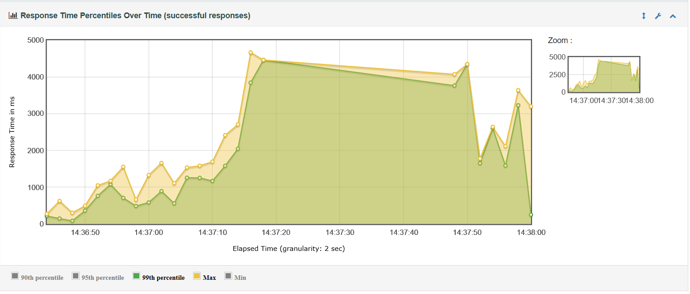
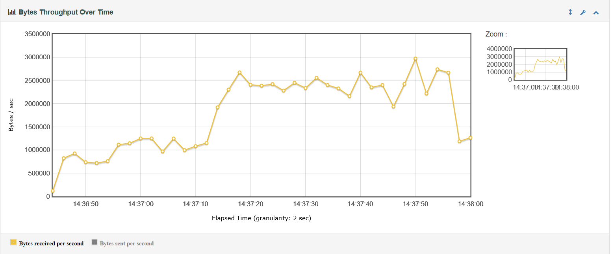
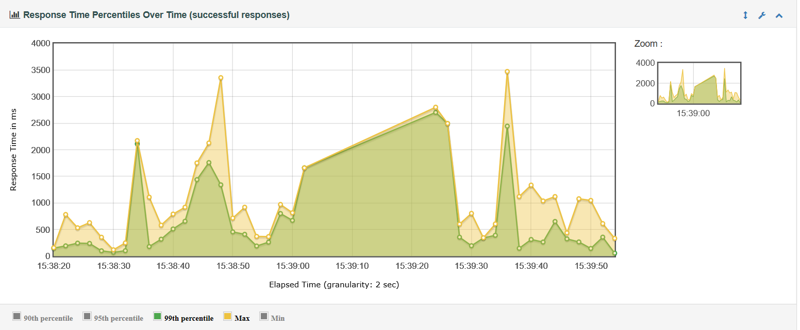
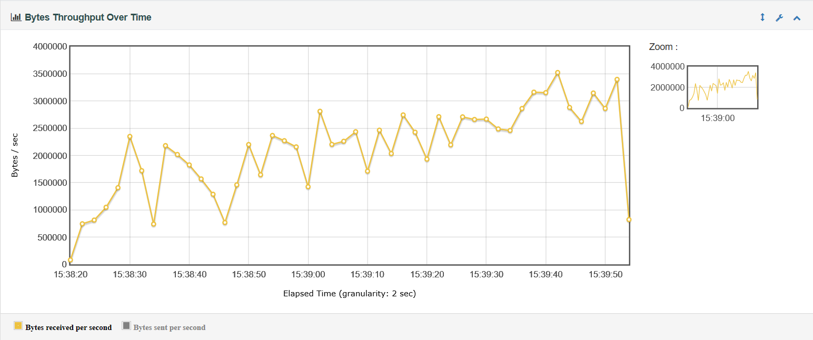
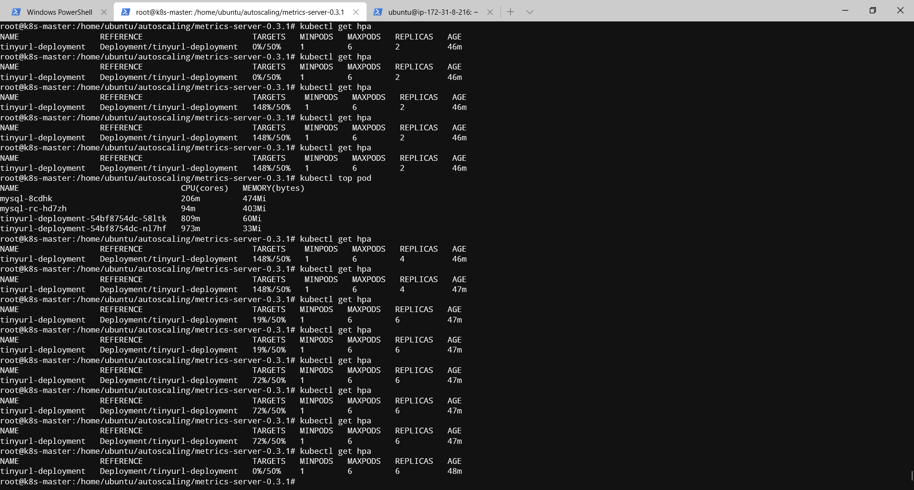
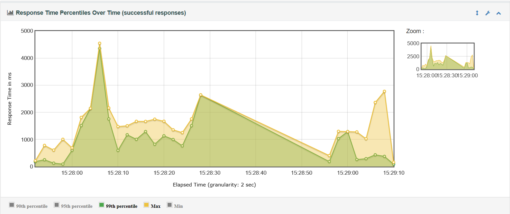
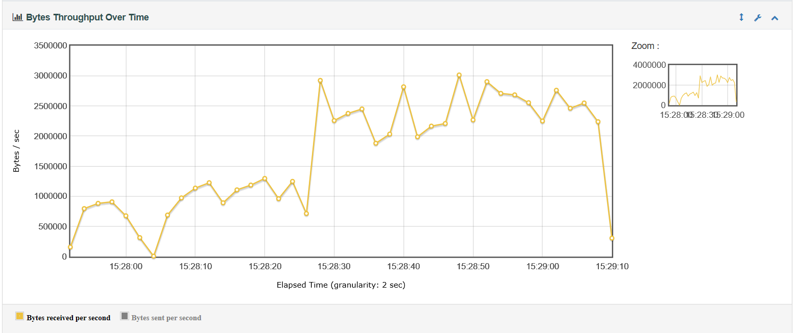

# 使用HPA对应用进行水平拓展

## 应用架构简介

tinyurl服务与redis两两绑定，即每个服务后端会和一个redis实例部署到一个pod，所有pod共享一个MySql服务。

## Autoscaling 部署

首先采用Deployment方式部署tinyurl服务，暴露4396到30002，使用resources项给出了期望资源值和限制资源值

```(yaml)
apiVersion: apps/v1
kind: Deployment
metadata:
  name: tinyurl-deployment
  namespace: application
  labels:
    app: jenkins
spec:
  selector:
    matchLabels:
      app: tinyurl
  replicas: 1
  template:
    metadata:
      labels:
        app: tinyurl
      name: tinyurl
      namespace: application
    spec:
      containers:
      - name: redis
        image: redis:latest
        ports:
        - containerPort: 6379
        resources:
          limits:
            cpu: 1000m
            memory: 1Gi
          requests:
            cpu: 300m
            memory: 512Mi
      - name: tinyurl
        image: divingfish/tinyurl:latest
        imagePullPolicy: Always
        ports:
        - containerPort: 4396
        resources:
          limits:
            cpu: 1000m
            memory: 1Gi
          requests:
            cpu: 300m
            memory: 512Mi

---

kind: Service
apiVersion: v1
metadata:
  labels:
    app: tinyurl
  name: tinyurl
  namespace: application
spec:
  type: NodePort
  ports:
    - port: 4396
      name: backend-svc
      nodePort: 30002
      targetPort: 4396
  selector:
    app: tinyurl
```

将服务注册为使用hpa进行水平伸缩：

```(sh)
kubectl autoscale deployment tinyurl-deployment --cpu-percent=50 --min=1 --max=6
```

上述指令与该yaml等价：

```(yaml)
apiVersion: autoscaling/v1
kind: HorizontalPodAutoscaler
metadata:
  name: tinyurl
  namespace: application
spec:
  scaleTargetRef:
    apiVersion: apps/v1
    kind: Deployment
    name: tinyurl-deployment
  minReplicas: 1
  maxReplicas: 6
  targetCPUUtilizationPercentage: 50
```

使用HPA做拓展时，会自动进行load balance。

## 性能测试与比较

### 测试方法

1. 使用JMeter GUI创建jmx文件，测试设置为从csv文件中随机选取可用key发送请求，线程数和循环次数依次设置为2000*100, 3000*100, 4000*100...7000*100.
2. 在另外一台AWS服务器上（m5.2xlarge），安装JMeter 5.1并使用编写好的jmx文件和csv文件进行测试，输出html报告。

### 测试结果以及结论

#### 未做Autoscaling时的测试结果




线程数设置为3000，循环100次。


#### Autoscaling时的测试结果
以线程数为7000，循环100次为例：



当线程数为其他值时也有类似结果。
#### 结论

查看没有Autoscaling的结果，可以发现在压力提高之后response time显著提高，throughput在中后期基本稳定，说明达到最大吞吐量。
查看设置Autoscaling之后的结果，可以发现，在每次压力提升之后response time有一个上升，但因为自动拓展的存在，又会下降，表现为一个一个分离的峰值。而throughput总体上也有一个上升趋势，说明还有一些余量。
与手动查看的hpa情况对比，发现response time变化规律符合autoscaling状态


两者对比，可以发现Autoscaling的效果是很好的，在更大的压力下Response time总体显著低于无autoscaling的情况，吞吐量仍有余量。

<!-- 

另有线程数设置为3000，循环100次时结果。

 -->
