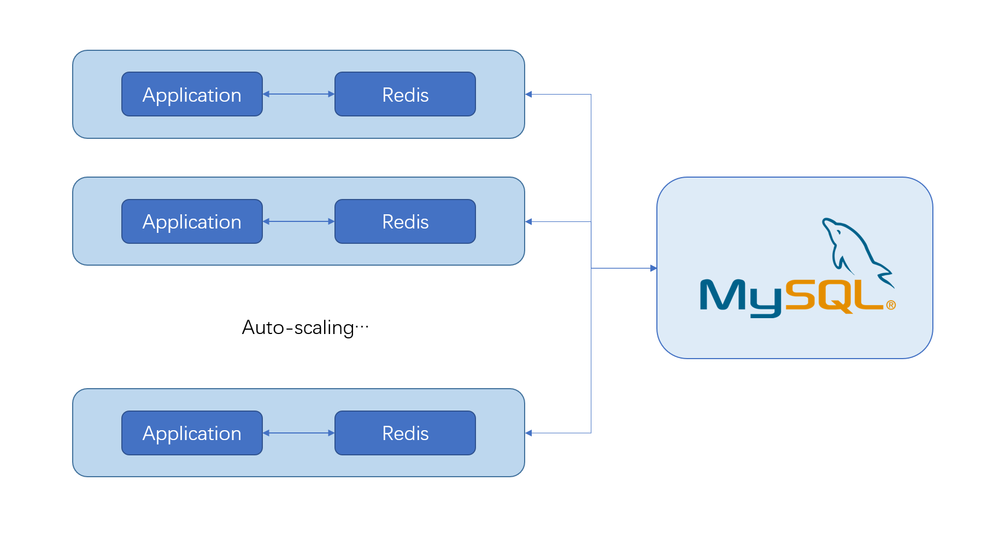
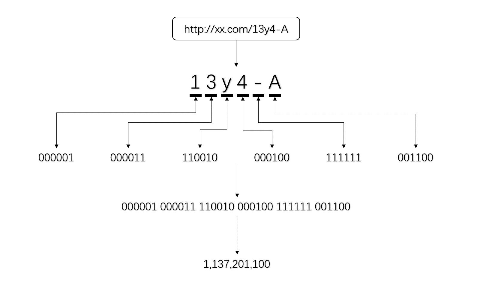

# Framework of Auto-scaling Tinyurl Application

## Overview

The graph above shows the framework of the auto-scaling tinyurl application.

Each pod in k8s contains an application instance and a redis instance (as cache of reading), connects and transfer data with a mysql database. These pods can auto-scale when the loads increase beyond their limits.

## Mapping tinyurl to string

Tinyurl are 6-character length with 32-bit (actually 36-bit) address spaces. The encoder are like base64, mapping 0...z to 0...61, '_' to 62, and '-' to 63. 

For example, url http://xx.com/13y4-A is decoded in this way:

The result is 1,137,201,100.

## Data structure

The long urls are stored in mysql databases as key-value pairs. The key is an int32, and the value is a string. But in redis, it directly stores encoded-string as its key.

By the way, when long urls are stored in database, it cannot be modified and removed at all. If user try to add an duplicate url, the application doesn't insert it, but searches it and return its tiny url, as if the duplicate url is added just now.